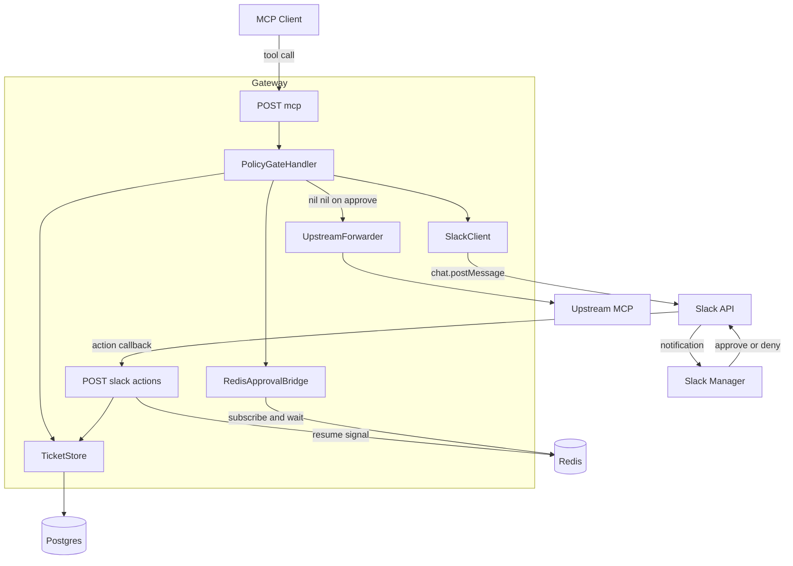
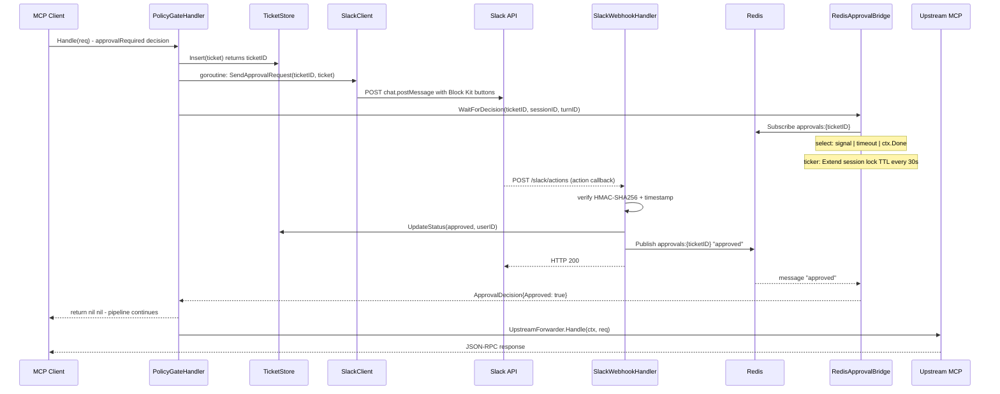
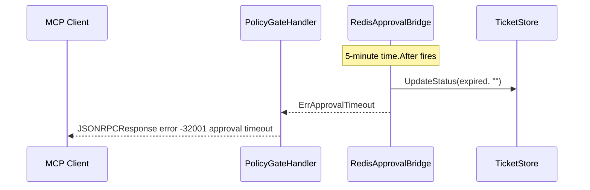
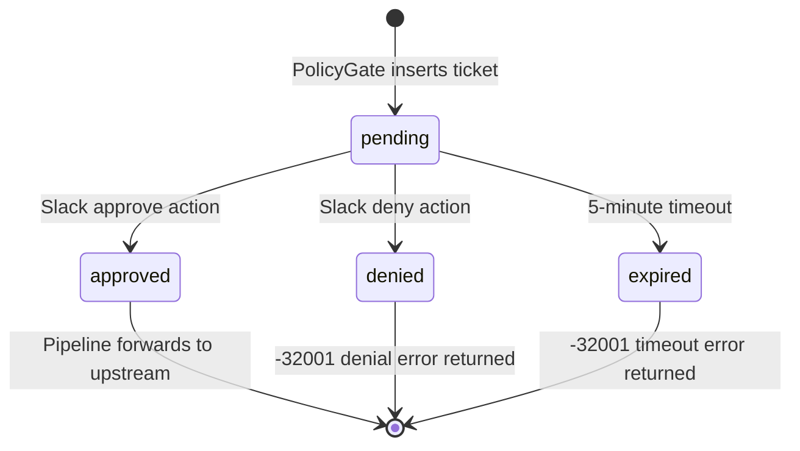

# Design Document: approval-flow

## Overview

The approval-flow feature completes the human-in-the-loop circuit for `approvalRequired` policy decisions. Instead of returning a `pending` response immediately, the gateway holds the HTTP connection open: it inserts a ticket record, fires a Slack Block Kit notification in a goroutine, then blocks in a `select` waiting for either a Redis Pub/Sub resume signal or a 5-minute timeout. The Slack `/slack/actions` webhook receives the manager's decision, persists it to Postgres, and publishes the resume signal. On approval the pipeline continues naturally to the upstream forwarder; on denial or timeout the handler returns a JSON-RPC `-32001` error.

This spec extends two upstream slices — **policy-gate** (the ticket table and the `approvalRequired` decision path) and **session-mgmt** (the Redis session lock, whose TTL is extended during the approval wait). The eval-gate demo depends on this spec being complete.

### Goals

- Hold HTTP connections open during approval wait without pipeline restructuring
- Notify Slack with an actionable Block Kit message (tool details + Approve/Deny buttons)
- Process webhook decisions securely (HMAC-SHA256 + 5-minute replay window)
- Persist decisions to Postgres before signaling (durability before notification)
- Handle timeouts and failures cleanly (clear error codes, ticket status transitions)

### Non-Goals

- Email, PagerDuty, Teams, or other notification channels (v1+)
- Multi-approver quorum (v1+)
- Approval history dashboard or query API (v1+)
- Async "fire-and-return" approval model (v1+)
- Approval state surviving a gateway restart

---

## Boundary Commitments

### This Spec Owns

- `POST /slack/actions` endpoint: request verification, action routing, ticket status update, pub/sub signal publication
- `ApprovalBridge` interface and `RedisApprovalBridge` implementation: blocking wait with TTL extension and 5-minute timeout
- `SlackNotifier` interface and `SlackClient` implementation: Block Kit message construction and delivery via `chat.postMessage`
- Modification to `PolicyGateHandler`: replacing the immediate-return pending path with an approval hold
- `TicketStore.UpdateStatus()`: new method for status transitions (`approved`, `denied`, `expired`)
- `Config` Slack fields (`SlackBotToken`, `SlackSigningSecret`, `SlackChannel`) with startup validation

### Out of Boundary

- Pipeline handler registration order (no changes to `mcp.Pipeline`)
- The ticket table schema (existing `status` enum values `approved`, `denied`, `expired` already defined in policy-gate)
- Redis distributed lock management (owned by `SessionLocker` from session-mgmt)
- Upstream MCP forwarding (owned by `UpstreamForwarder`; approval-flow returns `(nil, nil)` on approval to let the pipeline call it)
- Audit logging (owned by `AuditWriter` in policy-gate)

### Allowed Dependencies

- `*TicketStore` — extended with new `UpdateStatus()` method; Insert() already exists
- `*SessionLocker` — `Extend()` called periodically by `RedisApprovalBridge`
- `*redis.Client` — reused for pub/sub alongside existing lock usage
- `mcp.Pipeline`, `mcp.JSONRPCRequest`, `mcp.JSONRPCResponse` — no interface changes
- `net/http`, `crypto/hmac`, `crypto/sha256`, `encoding/json` — stdlib only; no new external dependencies

### Revalidation Triggers

- `PolicyGateHandler` constructor signature changes (adds `ApprovalBridge` and `SlackNotifier` params)
- `TicketStore.UpdateStatus()` addition — any code depending on `TicketStore`'s method set should verify no collision
- `Config` struct additions — any code constructing or copying `Config` needs updating
- HTTP server `WriteTimeout` — any deployment setting it below 5 minutes will break approval waits
- `POST /slack/actions` endpoint contract — eval-gate demo must wire a Slack test fixture against this endpoint

---

## Architecture

### Existing Architecture Analysis

The gateway uses a middleware-style `Pipeline` where handlers are registered via `pipeline.Use()`. The registration order determines execution order; the terminal `UpstreamForwarder` is registered at pipeline construction. The handler contract is:

- `(nil, nil)` → continue to next handler / terminal forwarder
- `(*JSONRPCResponse, nil)` → halt pipeline, return response
- `(nil, error)` → halt pipeline, return error

`PolicyGateHandler` is the last registered middleware. Currently, the `approvalRequired` branch returns `(*JSONRPCResponse{pending}, nil)` immediately. The approval-flow changes this to block for up to 5 minutes, then return `(nil, nil)` on approval (letting the pipeline continue to the forwarder) or `(*JSONRPCResponse{-32001}, nil)` on denial/timeout. No pipeline changes are required.

### Architecture Pattern and Boundary Map

Extension of the existing middleware pipeline pattern. Three new collaborators are introduced that `PolicyGateHandler` delegates to:



### Technology Stack

| Layer | Choice / Version | Role in Feature |
|-------|-----------------|----------------|
| Backend | Go 1.22+, existing `cmd/gateway` binary | All new components compile into the existing binary |
| Messaging | `go-redis/v9` (already present) | Redis Pub/Sub for approval resume signals; `Subscribe()` + `Publish()` |
| Data | Postgres via `pgxpool` (already present) | `ticket` table `UpdateStatus()` |
| External API | Slack `chat.postMessage` REST API | Block Kit notification delivery |
| Security | `crypto/hmac` + `crypto/sha256` (stdlib) | Slack request signature verification |
| HTTP | `net/http` (stdlib) | `/slack/actions` webhook endpoint |

No new external dependencies are introduced.

---

## File Structure Plan

### New Files

```
cmd/gateway/
├── approval_bridge.go    # ApprovalBridge interface, ApprovalDecision, RedisApprovalBridge
├── slack_notifier.go     # SlackNotifier interface, SlackClient (chat.postMessage)
└── slack_webhook.go      # SlackWebhookHandler, slackBlockActionsPayload types
```

### Modified Files

- `cmd/gateway/config.go` — add `SlackBotToken`, `SlackSigningSecret`, `SlackChannel` fields and startup validation
- `cmd/gateway/ticket.go` — add `UpdateStatus(ctx, id, status, decidedBy string) error` to `TicketStore`
- `cmd/gateway/policy_gate.go` — inject `ApprovalBridge` and `SlackNotifier`; replace immediate pending return with blocking approval hold
- `cmd/gateway/server.go` — add `*SlackWebhookHandler` field; register `POST /slack/actions` route in `NewServer()`
- `cmd/gateway/main.go` — construct `SlackClient`, `RedisApprovalBridge`, `SlackWebhookHandler`; inject into `PolicyGateHandler` and `Server`

---

## System Flows

### Approval Happy Path (Approve)



### Timeout Path



### Ticket Status Lifecycle



---

## Requirements Traceability

| Requirement | Summary | Components | Notes |
|-------------|---------|------------|-------|
| 1.1 | Hold HTTP connection on approvalRequired | `PolicyGateHandler`, `RedisApprovalBridge` | Inline blocking via `WaitForDecision` |
| 1.2 | Extend session lock TTL during wait | `RedisApprovalBridge`, `SessionLocker` | Ticker at `lockTTL/2` interval |
| 1.3 | Forward call on approved | `PolicyGateHandler` returns `(nil, nil)` | Pipeline continues to `UpstreamForwarder` |
| 1.4 | Return -32001 on denied | `PolicyGateHandler` | `JSONRPCResponse.Error{Code: -32001, Message: "approval denied"}` |
| 1.5 | 5-min timeout → -32001 approval timeout | `RedisApprovalBridge`, `PolicyGateHandler` | `time.After` in `select`; `ErrApprovalTimeout` sentinel |
| 2.1 | Block Kit message with tool details + session ID | `SlackClient` | Section + Actions blocks in message payload |
| 2.2 | Approve/Deny buttons carrying ticketID | `SlackClient` | `action_id: "approval_approve"/"approval_deny"`, `value: ticketID` |
| 2.3 | Log Slack failure, continue hold | `PolicyGateHandler` | Goroutine logs error; `WaitForDecision` continues unaffected |
| 2.4 | Credentials from env vars only | `Config`, `SlackClient` | `SLACK_BOT_TOKEN` |
| 3.1 | POST /slack/actions endpoint | `SlackWebhookHandler`, `Server` | Registered in `NewServer()` |
| 3.2 | HMAC-SHA256 verification | `SlackWebhookHandler` | `crypto/hmac`; raw body read before form parse |
| 3.3 | HTTP 400 on bad signature | `SlackWebhookHandler` | Early return before ticket lookup |
| 3.4 | 5-min replay window on timestamp | `SlackWebhookHandler` | `abs(now - ts) > 5min → 400` |
| 3.5 | Signing secret from env var | `Config` | `SLACK_SIGNING_SECRET` |
| 4.1 | Update approved + publish signal | `SlackWebhookHandler`, `TicketStore` | `UpdateStatus` then `Publish` |
| 4.2 | Update denied + publish signal | `SlackWebhookHandler`, `TicketStore` | Same ordering as 4.1 |
| 4.3 | Update before publish | `SlackWebhookHandler` | Sequential: `UpdateStatus` completes before `Publish` |
| 4.4 | HTTP 200 acknowledgment | `SlackWebhookHandler` | Dismisses Slack button interaction |
| 5.1 | 5-min timeout → -32001 approval timeout | `RedisApprovalBridge` | `time.After(5 * time.Minute)` in `select` |
| 5.2 | Update ticket to expired on timeout | `RedisApprovalBridge` | `tickets.UpdateStatus(ctx, id, "expired", "")` |
| 5.3 | Channel failure treated as timeout | `RedisApprovalBridge` | `nil` message on closed channel triggers timeout path |
| 5.4 | Log timeout/error with ticketID and sessionID | All components | `slog.Error` with structured fields |
| 6.1 | SLACK_CHANNEL env var | `Config` | Required; startup fails if absent |
| 6.2 | SLACK_SIGNING_SECRET env var | `Config` | Required; startup fails if absent |
| 6.3 | SLACK_BOT_TOKEN env var | `Config` | Required; startup fails if absent |
| 6.4 | Fail fast on missing Slack vars | `Config.LoadConfig()` | Returns error listing missing variables |

---

## Components and Interfaces

### Summary

| Component | Domain | Intent | Req Coverage | Key Dependencies |
|-----------|--------|--------|--------------|-----------------|
| `RedisApprovalBridge` | Approval Hold | Blocks until decision signal or timeout; extends session lock | 1.1–1.5, 5.1–5.4 | `redis.Client` (P0), `SessionLocker` (P0), `TicketStore` (P1) |
| `SlackClient` | Notification | Sends Block Kit approval request via `chat.postMessage` | 2.1–2.4 | Slack API (P0) |
| `SlackWebhookHandler` | Webhook | Verifies Slack signature; routes approve/deny; updates ticket; publishes signal | 3.1–3.5, 4.1–4.4 | `TicketStore` (P0), `redis.Client` (P0) |
| `PolicyGateHandler` (modified) | Gate | Replaces pending-return path with blocking approval hold | 1.1, 1.3, 1.4, 2.3, 5.4 | `ApprovalBridge` (P0), `SlackNotifier` (P1) |
| `TicketStore` (extended) | Data | Adds `UpdateStatus()` for terminal status transitions | 4.1, 4.2, 5.2 | `pgxpool.Pool` (P0) |
| `Config` (extended) | Config | Adds Slack fields with startup validation | 2.4, 3.5, 6.1–6.4 | — |

---

### Approval Hold Layer

#### `ApprovalBridge` Interface and `RedisApprovalBridge`

| Field | Detail |
|-------|--------|
| Intent | Abstract the blocking wait for a human decision; decouple `PolicyGateHandler` from Redis Pub/Sub mechanics |
| Requirements | 1.1, 1.2, 1.5, 5.1, 5.2, 5.3, 5.4 |

**Interface**

```go
// ApprovalDecision is the outcome of a completed approval wait.
type ApprovalDecision struct {
    Approved bool
    TicketID string
}

// ApprovalBridge abstracts the blocking wait mechanism. v0 implements with
// Redis Pub/Sub; the interface allows alternative mechanisms in later slices.
type ApprovalBridge interface {
    // WaitForDecision blocks until a resume signal arrives, ctx is cancelled,
    // or the 5-minute timeout fires. On timeout it updates the ticket status
    // to "expired" before returning ErrApprovalTimeout.
    WaitForDecision(ctx context.Context, ticketID, sessionID, turnID string) (ApprovalDecision, error)
}

// ErrApprovalTimeout is returned when no decision arrives within the timeout window.
var ErrApprovalTimeout = errors.New("approval timeout")
```

**`RedisApprovalBridge` Implementation**

```go
type RedisApprovalBridge struct {
    redis              *redis.Client
    tickets            *TicketStore
    locker             *SessionLocker
    timeout            time.Duration // fixed at 5 minutes
    lockExtendInterval time.Duration // lockTTL / 2
    log                *slog.Logger
}

func NewRedisApprovalBridge(
    redis    *redis.Client,
    tickets  *TicketStore,
    locker   *SessionLocker,
    lockTTL  time.Duration,
    log      *slog.Logger,
) *RedisApprovalBridge
```

**`WaitForDecision` behaviour**:

1. Subscribe to Redis channel `approvals:{ticketID}` via `client.Subscribe(ctx, channelName)`
2. Start a `time.NewTicker(lockExtendInterval)` to call `locker.Extend(ctx, sessionID, turnID)` periodically
3. `select` on: `pubsub.Channel()` message, `time.After(5 * time.Minute)`, `ctx.Done()`
4. On message payload `"approved"`: clean up, return `ApprovalDecision{Approved: true}`
5. On message payload `"denied"`: clean up, return `ApprovalDecision{Approved: false}`
6. On closed/nil channel or `ctx.Done()`: clean up, return error
7. On timeout: call `tickets.UpdateStatus(ctx, ticketID, "expired", "")`, clean up, return `ErrApprovalTimeout`

Lock extend errors are logged but do not abort the wait.

**Dependencies**
- External: `*redis.Client` — Pub/Sub subscribe + message receive (P0)
- Outbound: `*SessionLocker` — `Extend()` for lock TTL (P0)
- Outbound: `*TicketStore` — `UpdateStatus()` on timeout (P1)

**Contracts**: Service [x] / Event [x]

**Implementation Notes**
- Redis pub/sub channel: `"approvals:" + ticketID`
- Pub/Sub message payload: plain string `"approved"` or `"denied"`
- `lockExtendInterval = lockTTL / 2` (e.g., 30s when lockTTL = 60s)
- Always defer `pubsub.Close()` to release Redis connection
- Risk: if the Redis connection drops mid-wait, `pubsub.Channel()` closes; the nil-message branch falls through to the timeout path (req 5.3)

---

### Notification Layer

#### `SlackNotifier` Interface and `SlackClient`

| Field | Detail |
|-------|--------|
| Intent | Send Block Kit approval request messages to Slack; decoupled via interface for v1+ channel swap |
| Requirements | 2.1, 2.2, 2.3, 2.4 |

**Interface**

```go
// SlackNotifier abstracts outbound approval notification.
// v0 implements with Slack chat.postMessage; v1+ may add other channels.
type SlackNotifier interface {
    // SendApprovalRequest sends a Block Kit message with Approve/Deny buttons.
    // ticketID is embedded in button values for routing on callback.
    // Errors are non-fatal: the caller logs and continues the approval hold.
    SendApprovalRequest(ctx context.Context, ticketID string, t TicketRecord) error
}
```

**`SlackClient` Implementation**

```go
type SlackClient struct {
    botToken   string
    channel    string
    httpClient *http.Client
    log        *slog.Logger
}

func NewSlackClient(botToken, channel string, log *slog.Logger) *SlackClient
```

`SendApprovalRequest` constructs a Block Kit payload and POSTs to `https://slack.com/api/chat.postMessage` with `Authorization: Bearer {botToken}` and `Content-Type: application/json`.

**Block Kit payload structure** (key fields):
- `channel`: configured Slack channel
- `blocks[0]`: `section` block with tool name, operation, arguments (truncated), and session ID in `mrkdwn`
- `blocks[1]`: `actions` block with two `button` elements:
  - Approve: `action_id: "approval_approve"`, `value: ticketID`
  - Deny: `action_id: "approval_deny"`, `value: ticketID`

**Dependencies**
- External: Slack `chat.postMessage` REST API (P0); `Authorization: Bearer {SLACK_BOT_TOKEN}`

**Contracts**: Service [x] / API [x]

**Implementation Notes**
- Called in a goroutine with `context.Background()` so Slack delivery is not cancelled by request context
- Risk: long argument payloads should be truncated to avoid Slack message limits (~3000 chars per block)

---

### Webhook Layer

#### `SlackWebhookHandler`

| Field | Detail |
|-------|--------|
| Intent | Receive Slack interactive action callbacks; verify authenticity; update ticket; publish resume signal |
| Requirements | 3.1–3.5, 4.1–4.4 |

**Type and Constructor**

```go
type SlackWebhookHandler struct {
    signingSecret string
    tickets       *TicketStore
    redis         *redis.Client
    log           *slog.Logger
}

func NewSlackWebhookHandler(
    signingSecret string,
    tickets       *TicketStore,
    redis         *redis.Client,
    log           *slog.Logger,
) *SlackWebhookHandler

func (h *SlackWebhookHandler) ServeHTTP(w http.ResponseWriter, r *http.Request)
```

**`ServeHTTP` request processing order** (order is not negotiable for security):

1. Read raw request body into `[]byte` (required for HMAC; must happen before any parsing)
2. Extract `X-Slack-Request-Timestamp`; reject with 400 if `|now - ts| > 5min`
3. Build HMAC base string: `"v0:" + timestamp + ":" + string(rawBody)`
4. Compute `HMAC-SHA256(signingSecret, basestring)` → prefix with `"v0="`
5. Compare with `X-Slack-Signature` using `hmac.Equal` (constant-time); reject with 400 on mismatch
6. URL-decode the `payload` form field from `rawBody`; unmarshal into `slackBlockActionsPayload`
7. Route on `actions[0].ActionID`: `"approval_approve"` or `"approval_deny"`
8. Extract `ticketID` from `actions[0].Value`
9. Call `tickets.UpdateStatus(ctx, ticketID, status, userID)` — on error, return 500 (decision not persisted; do not publish)
10. Call `redis.Publish(ctx, "approvals:"+ticketID, status)` — on error, log warning (ticket is persisted; waiter will timeout per req 5.3)
11. Return HTTP 200 with empty body

**Slack Payload Types** (internal to `slack_webhook.go`):

```go
type slackBlockActionsPayload struct {
    Type    string        `json:"type"`
    User    slackUser     `json:"user"`
    Actions []slackAction `json:"actions"`
}

type slackUser struct {
    ID string `json:"id"`
}

type slackAction struct {
    ActionID string `json:"action_id"`
    Value    string `json:"value"`
}
```

**API Contract**

| Method | Endpoint | Request | Response | Errors |
|--------|----------|---------|----------|--------|
| POST | /slack/actions | URL-encoded form with `payload` field (JSON) | 200 empty | 400 (bad signature, replay, unknown action), 500 (UpdateStatus failure) |

**Dependencies**
- Outbound: `*TicketStore` — `UpdateStatus()` (P0)
- External: `*redis.Client` — `Publish()` (P0)

**Contracts**: API [x]

**Implementation Notes**
- The `payload` field is URL-encoded; use `url.QueryUnescape` or `r.FormValue` after extracting raw body
- `hmac.Equal` is constant-time; do not use `==` for signature comparison
- Return 500 (not 200) if `UpdateStatus` fails; Slack will retry the delivery
- Risk: if Slack retries and the first update succeeded, a duplicate `UpdateStatus` call will attempt to update an already-terminal ticket — `UpdateStatus` should be idempotent (update only if `status = 'pending'`)

---

### Data Layer

#### `TicketStore` (extended)

| Field | Detail |
|-------|--------|
| Intent | Add terminal status transition to the existing ticket persistence layer |
| Requirements | 4.1, 4.2, 5.2 |

**New method**:

```go
// UpdateStatus transitions a ticket from pending to a terminal status.
// decidedBy is the Slack user ID for approve/deny; empty string for system-triggered (expired).
// Implementation should be idempotent: only update if current status = 'pending'.
func (s *TicketStore) UpdateStatus(ctx context.Context, id, status, decidedBy string) error
```

Writes `status`, `decision_by`, and `decided_at = now()` to the `ticket` table where `id = $1 AND status = 'pending'`.

**Contracts**: Service [x]

---

#### `Config` (extended)

New fields added to the `Config` struct and populated by `LoadConfig()`:

```go
SlackBotToken      string // SLACK_BOT_TOKEN     (required)
SlackSigningSecret string // SLACK_SIGNING_SECRET (required)
SlackChannel       string // SLACK_CHANNEL        (required)
```

`LoadConfig()` validation: if any of the three fields is empty after loading, return an error listing the missing variable names. The gateway binary exits on this error.

---

### Modified: `PolicyGateHandler`

The `approvalRequired` branch is replaced with:

```go
// New fields on PolicyGateHandler:
bridge   ApprovalBridge
notifier SlackNotifier

// New approvalRequired path (pseudocode):
ticketID, err := h.tickets.Insert(ctx, record)
go func() {
    if err := h.notifier.SendApprovalRequest(context.Background(), ticketID, record); err != nil {
        h.log.Error("slack notification failed", "ticketID", ticketID, "error", err)
    }
}()
decision, err := h.bridge.WaitForDecision(ctx, ticketID, sessionID, turnID)
if errors.Is(err, ErrApprovalTimeout) {
    h.log.Error("approval timed out", "ticketID", ticketID, "sessionID", sessionID)
    return approvalErrorResponse(req.ID, "approval timeout"), nil
}
if err != nil || !decision.Approved {
    h.log.Info("approval denied", "ticketID", ticketID, "sessionID", sessionID)
    return approvalErrorResponse(req.ID, "approval denied"), nil
}
// Approved: return (nil, nil) — pipeline continues to UpstreamForwarder
return nil, nil
```

`approvalErrorResponse` returns `&mcp.JSONRPCResponse{JSONRPC: "2.0", ID: req.ID, Error: &mcp.JSONRPCError{Code: -32001, Message: msg}}`.

---

## Data Models

### Ticket Status Transitions

No schema changes. The `ticket.status` enum already includes `approved`, `denied`, `expired`. This spec activates the transitions that policy-gate left idle.

```
pending → approved  (Slack approve action, via UpdateStatus)
pending → denied    (Slack deny action, via UpdateStatus)
pending → expired   (5-minute timeout, via UpdateStatus in WaitForDecision)
```

`decided_at` and `decision_by` are set on `approved` and `denied` transitions. `decision_by` is empty for `expired`.

### Redis Pub/Sub Channel Schema

| Field | Value |
|-------|-------|
| Channel name | `"approvals:" + ticketID` (UUID, unique per ticket) |
| Publisher | `SlackWebhookHandler` |
| Subscriber | `RedisApprovalBridge` (one subscriber per in-flight approval) |
| Payload | Plain string: `"approved"` or `"denied"` |
| Lifecycle | Subscriber created when `WaitForDecision` is entered; closed on decision, timeout, or ctx cancellation |

No Redis key persistence — pub/sub only. If no subscriber is listening when the signal is published (e.g., gateway restart), the signal is lost and the waiter will timeout.

---

## Error Handling

### Error Strategy

Fail fast at startup (missing Slack config); fail safe at runtime (non-fatal notification failures continue the hold; fatal ticket update failures surface to Slack as 5xx for retry).

### Error Categories

| Error | Handler | Response |
|-------|---------|----------|
| Slack notification failure | `PolicyGateHandler` goroutine | Log error; approval hold continues; timeout path applies |
| Bad Slack signature | `SlackWebhookHandler` | HTTP 400; no action taken |
| Timestamp replay | `SlackWebhookHandler` | HTTP 400; no action taken |
| `UpdateStatus` failure | `SlackWebhookHandler` | HTTP 500; Slack retries; `UpdateStatus` is idempotent |
| Redis Publish failure | `SlackWebhookHandler` | Log warning; HTTP 200 (ticket persisted; waiter will timeout per 5.3) |
| `WaitForDecision` timeout | `RedisApprovalBridge` → `PolicyGateHandler` | Ticket marked `expired`; `-32001 "approval timeout"` returned to client |
| Redis Pub/Sub connection loss | `RedisApprovalBridge` | Channel closes; nil-message branch triggers timeout path |
| Client disconnection (ctx cancel) | `RedisApprovalBridge` | `ctx.Done()` fires; subscription cleaned up; no response sent |
| Missing Slack env vars | `Config.LoadConfig()` | Gateway refuses to start; logs missing variable names |

### Monitoring

All error paths emit `slog.Error` or `slog.Warn` with structured fields: `ticketID`, `sessionID`, `error`. Timeout events additionally log `turnID`.

---

## Testing Strategy

### Unit Tests

- `SlackWebhookHandler.ServeHTTP`:
  - Valid approve action → `UpdateStatus("approved")` called, signal published, HTTP 200
  - Valid deny action → `UpdateStatus("denied")` called, signal published, HTTP 200
  - Invalid HMAC signature → HTTP 400, no DB/Redis calls
  - Timestamp older than 5 minutes → HTTP 400, no DB/Redis calls
  - `UpdateStatus` returns error → HTTP 500, Publish not called
- `RedisApprovalBridge.WaitForDecision`:
  - Approve signal received → `ApprovalDecision{Approved: true}` returned
  - Deny signal received → `ApprovalDecision{Approved: false}` returned
  - Timeout fires → `tickets.UpdateStatus("expired")` called, `ErrApprovalTimeout` returned
  - Pub/Sub channel closes (nil message) → timeout path triggered
  - Context cancelled → clean return, no UpdateStatus call
  - Lock extend error → logged, wait continues
- `SlackClient.SendApprovalRequest`:
  - Correct Block Kit JSON structure (action_id, value fields)
  - Correct Authorization header
  - HTTP client error → returns wrapped error
- `PolicyGateHandler` approval path (mock bridge + notifier):
  - Bridge returns approved → handler returns `(nil, nil)`
  - Bridge returns denied → handler returns `(-32001 "approval denied", nil)`
  - Bridge returns `ErrApprovalTimeout` → handler returns `(-32001 "approval timeout", nil)`
  - Notifier error → logged, does not block WaitForDecision

### Integration Tests

- Full approve flow: insert ticket → subscribe → `UpdateStatus("approved")` + Publish → verify `WaitForDecision` returns `Approved: true` (real Redis + real Postgres)
- Full deny flow: same structure, deny path
- Timeout flow: set `timeout = 100ms`; verify ticket transitions to `expired` and `ErrApprovalTimeout` returned
- Idempotent `UpdateStatus`: call twice with `approved`; second call is a no-op (status already non-pending)

### End-to-End Tests

- Docker Compose with real Redis and Postgres; gateway binary running
- Send `approvalRequired` MCP tool call; verify HTTP connection held open
- `curl POST /slack/actions` with correctly signed payload (approve); verify tool response returned
- `curl POST /slack/actions` with correctly signed payload (deny); verify `-32001` returned
- `curl POST /slack/actions` with bad signature; verify HTTP 400

---

## Security Considerations

- **Signature verification**: Raw body bytes are read into a buffer before any parsing. HMAC-SHA256 computed using `crypto/hmac`; comparison via `hmac.Equal` (constant-time) to prevent timing attacks. Do not use `==`.
- **Replay protection**: `X-Slack-Request-Timestamp` checked against `time.Now()`; requests with `|delta| > 5 minutes` are rejected with HTTP 400.
- **Secret handling**: `SlackBotToken` and `SlackSigningSecret` loaded from env vars; never logged. Consider redacting in structured log output.
- **Pub/Sub signal trust**: The resume signal (`"approved"`/`"denied"`) is an internal Redis channel with a UUID ticket ID in the key. The actual decision is authoritative in Postgres; the signal is a notification only.
- **Action routing**: Unknown `action_id` values return HTTP 400 and are logged. This prevents unrecognized Slack components from triggering unintended behavior.

## Performance and Scalability

- Each in-flight approval hold occupies one goroutine (blocking on `select`) and one Redis Pub/Sub connection for up to 5 minutes.
- The HTTP server's `WriteTimeout` must be set to at least 5 minutes plus margin (recommend 360 seconds or zero for the `/mcp` route). This is a deployment configuration concern to document.
- Lock TTL extension generates approximately `(300s / 30s) = 10` Redis `PEXPIRE` operations per approval wait.
- v0 is single-instance; no fanout or broadcast concerns. Redis Pub/Sub channels are per-ticket (UUID-keyed).
