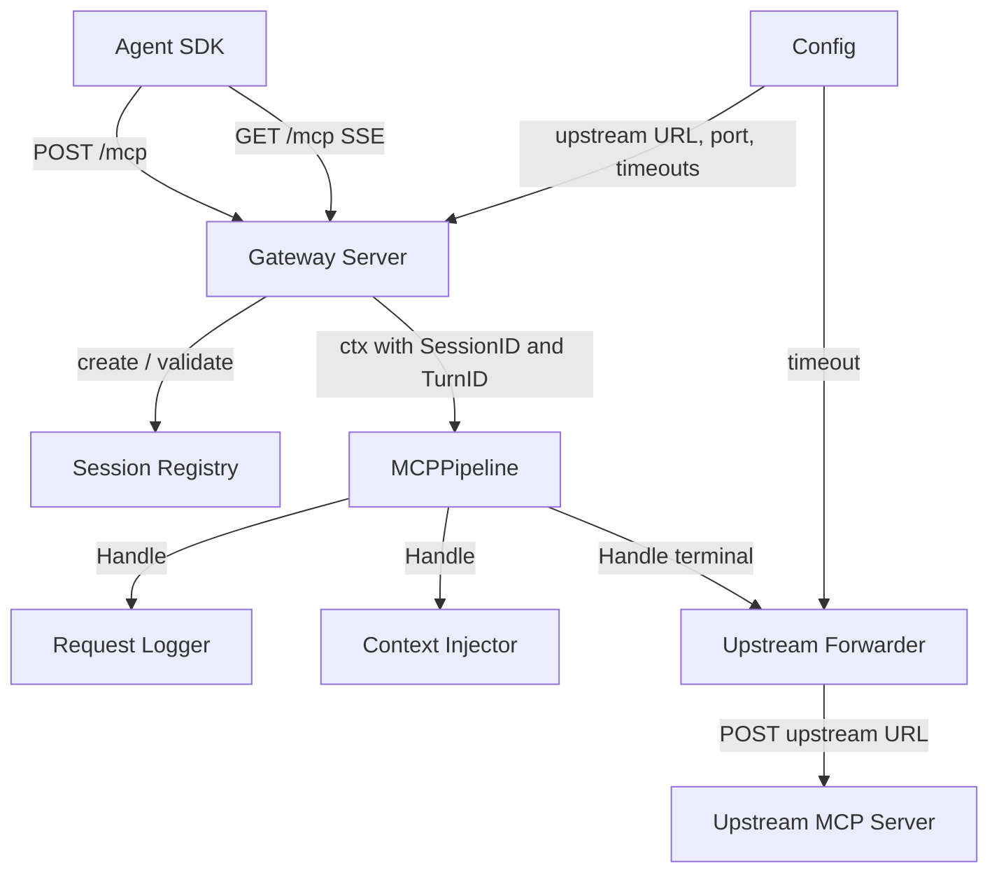
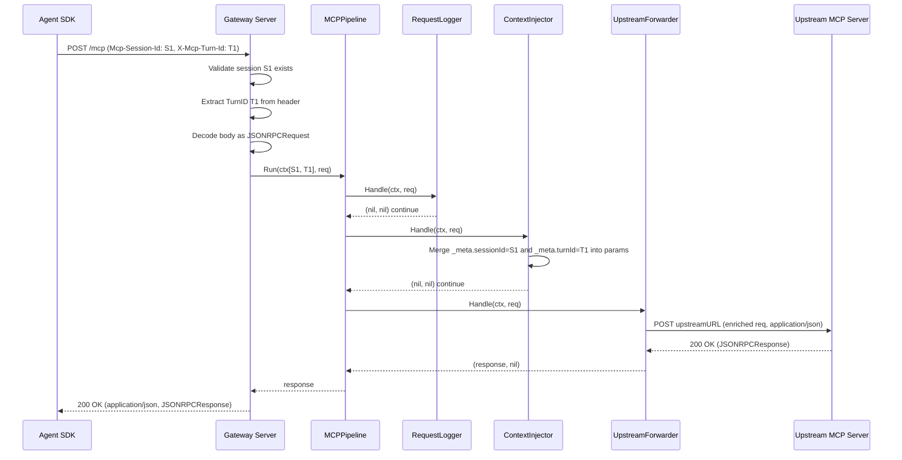
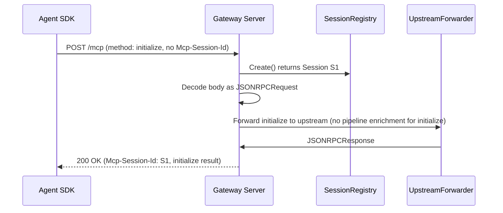

# Design Document: bare-proxy

## Overview

The bare-proxy is the first vertical slice of the AgentPlane v0 MCP gateway. It implements a transparent HTTP proxy that accepts MCP tool calls from agent SDKs, enriches each request with session and turn metadata, and forwards them to a configurable upstream MCP server — establishing the extensible pipeline that all subsequent governance slices (policy-gate, session-mgmt, approval-flow) register handlers into.

The gateway targets the current MCP **Streamable HTTP** transport (spec 2025-03-26 / 2025-06-18): `POST /mcp` for client→server requests, `GET /mcp` for server-initiated SSE notifications. The legacy `GET /sse` transport referenced in the discovery brief is deprecated per the MCP spec and is not implemented. See `research.md` for the transport decision rationale.

**Users**: AI platform developers wiring agent SDKs through AgentPlane. In v0, the primary consumer is the Python demo agent in the eval-gate slice.

### Goals

- Provide a working, testable MCP-transparent proxy with zero governance logic
- Establish the `Handler` pipeline interface that every subsequent slice extends without modifying the core proxy
- Enrich every outgoing MCP `tools/call` with `_meta.sessionId` and `_meta.turnId` before forwarding
- Produce structured logs per request that are safe by default (no argument values logged)

### Non-Goals

- Policy evaluation of any kind (slice 2)
- Redis session locking or durability (slice 3)
- Approval routing or Slack notification (slice 4)
- Eval orchestration (slice 5)
- Multi-upstream routing or load balancing
- Authentication or mTLS between gateway and upstream

---

## Boundary Commitments

### This Spec Owns

- The MCP Streamable HTTP endpoint (`POST /mcp`, `GET /mcp`) including session ID assignment on `initialize` and validation on subsequent requests
- Turn ID extraction from `X-Mcp-Turn-Id` request header (or generation when absent)
- Injection of `_meta.sessionId` and `_meta.turnId` into `params._meta` of outgoing MCP requests
- The `Handler` interface and `Pipeline` execution semantics (registration order, halt behavior, terminal forwarder)
- HTTP forwarding of enriched MCP JSON-RPC requests to the configured upstream MCP server
- In-memory session registry (no persistence; lost on restart)
- Structured logging via `log/slog` (no argument values logged by default)
- Startup validation (refuse to start if `UPSTREAM_MCP_URL` is unset)

### Out of Boundary

- Policy predicates, rule loading, or audit logging — slice 2 (policy-gate)
- Redis mutex, RWLock, turn serialization — slice 3 (session-mgmt)
- Slack notification, approval tickets, pub/sub resume — slice 4 (approval-flow)
- EvalSuite runner, Docker Compose, fake MCP servers — slice 5 (eval-gate)
- Persistent session storage across gateway restarts
- MCP tool schema discovery or tool registration

### Allowed Dependencies

- `github.com/modelcontextprotocol/go-sdk` — MCP message types only (not the full server/client framework)
- Go standard library: `net/http`, `log/slog`, `encoding/json`, `sync`, `context`
- No external router, ORM, Redis client, or Postgres client in this slice

### Revalidation Triggers

Changes to the following require downstream specs (policy-gate, session-mgmt, approval-flow) to re-check their integration:

- `Handler` interface signature — any change breaks all registered handlers
- `Pipeline.Run()` halt semantics — changes affect how handlers abort the chain
- `JSONRPCRequest` / `JSONRPCResponse` struct field changes
- `Mcp-Session-Id` or `X-Mcp-Turn-Id` header names
- Context key types (`contextKey`) used to pass SessionID/TurnID through `context.Context`
- `_meta` injection key names (`sessionId`, `turnId`)

---

## Architecture

### Architecture Pattern

The gateway is structured as a **layered pipeline** with a thin HTTP transport adapter at the top and a terminal forwarder at the bottom. Each layer has a single responsibility and communicates only with adjacent layers.



**Dependency direction** (innermost → outermost, no reverse imports):

```
core/mcp (types, pipeline, handler, forwarder)
  ↑
cmd/gateway (server, session, injector, logger, config, main)
```

`core/mcp` has no knowledge of the HTTP server, session registry, or gateway config. `cmd/gateway` imports `core/mcp` but not vice versa.

### Technology Stack

| Layer | Choice / Version | Role |
|-------|-----------------|------|
| Language | Go 1.22+ | Gateway binary, pipeline, forwarder |
| HTTP server | `net/http` stdlib | `POST /mcp`, `GET /mcp` handlers; method+path routing via Go 1.22 ServeMux |
| MCP types | `github.com/modelcontextprotocol/go-sdk` | Canonical `JSONRPCRequest`, `JSONRPCResponse` type definitions |
| Structured logging | `log/slog` (stdlib, Go 1.21+) | Per-request log entries; JSON output |
| Session state | `sync.Map` (in-memory) | SessionID registry; lost on restart (replaced by Redis in slice 3) |
| Upstream forwarding | `net/http` client (stdlib) | HTTP POST to upstream MCP server with configurable timeout |

---

## File Structure Plan

```
agentplane/
├── cmd/
│   └── gateway/
│       ├── main.go         # Entry point: load Config, build Pipeline, start Server
│       ├── config.go       # Config struct and env-var loading; startup validation
│       ├── server.go       # HTTP server; POST /mcp and GET /mcp handlers; session lifecycle
│       ├── session.go      # SessionRegistry (in-memory); Session type
│       ├── injector.go     # ContextInjector Handler: _meta.sessionId + _meta.turnId injection
│       └── logger.go       # RequestLogger Handler: per-request slog entry
│
└── core/
    └── mcp/
        ├── types.go        # JSONRPCRequest, JSONRPCResponse, JSONRPCError, MCPMeta, context keys
        ├── handler.go      # Handler interface + HandlerFunc adapter
        ├── pipeline.go     # Pipeline: Use(), Run(), terminal forwarder
        └── forwarder.go    # UpstreamForwarder Handler: HTTP POST to upstream, response parse
```

**Responsibility summary:**

| File | Owns |
|------|------|
| `core/mcp/types.go` | All shared MCP JSON-RPC types and context key constants |
| `core/mcp/handler.go` | The `Handler` interface — the single integration contract for all slices |
| `core/mcp/pipeline.go` | Ordered handler execution with halt semantics |
| `core/mcp/forwarder.go` | HTTP forwarding to upstream; SSE response unwrapping |
| `cmd/gateway/config.go` | Environment variable loading; startup guard for missing upstream URL |
| `cmd/gateway/server.go` | HTTP routing; session init/validation; ctx enrichment; error responses |
| `cmd/gateway/session.go` | In-memory session lifecycle (create, get, delete) |
| `cmd/gateway/injector.go` | `_meta` mutation for outgoing requests |
| `cmd/gateway/logger.go` | Structured log emission; argument-safe log fields |
| `cmd/gateway/main.go` | Wiring only: config → pipeline → server; no business logic |

---

## System Flows

### Tool Call Flow (tools/call, session already initialized)



Key decisions visible in the flow: Logger runs before Injector (logs the pre-enrichment method/tool name for traceability); Injector mutates `req.Params` in-place before forwarding; Forwarder is always the terminal node.

### Session Initialization Flow



`initialize` bypasses the pipeline (no meta injection needed; session ID not yet established). All subsequent requests require a valid `Mcp-Session-Id` header.

---

## Requirements Traceability

| Requirement | Summary | Component(s) | Interface / Contract |
|-------------|---------|--------------|---------------------|
| 1.1 | SessionID assigned on connect | `Server`, `SessionRegistry` | `SessionRegistry.Create()`, `Mcp-Session-Id` response header |
| 1.2 | Connection maintained while active | `Server` | `handleMCPPost`, `handleMCPGet` context lifecycle |
| 1.3 | SessionID released on close | `Server`, `SessionRegistry` | `SessionRegistry.Delete()` on `DELETE /mcp` or session TTL |
| 1.4 | Configurable port; endpoint path | `Config`, `Server` | `Config.ListenPort`; path is `/mcp` per Streamable HTTP spec (see research.md) |
| 2.1 | Extract TurnID from header | `Server` | `handleMCPPost` reads `Config.TurnIDHeader` |
| 2.2 | Generate TurnID if absent | `Server` | `handleMCPPost` generates UUID when header missing |
| 2.3 | Same TurnID per turn | `Server` | TurnID stored in `context.Context`; all pipeline handlers read same value |
| 3.1 | Inject SessionID + TurnID into `_meta` | `ContextInjector` | `Handle()` merges into `params._meta` |
| 3.2 | Merge without removing existing keys | `ContextInjector` | Unmarshal `_meta` as `map[string]json.RawMessage`; set only target keys |
| 3.3 | Create `_meta` if absent | `ContextInjector` | Create empty map when `_meta` key not present |
| 3.4 | No other field modification | `ContextInjector` | Only `params._meta.sessionId` and `params._meta.turnId` written |
| 4.1 | Forward enriched request; return upstream response | `UpstreamForwarder` | `Handle()` POSTs to upstream, returns parsed response |
| 4.2 | Upstream URL from config | `Config`, `UpstreamForwarder` | `Config.UpstreamMCPURL` injected at construction |
| 4.3 | Refuse to start if URL missing | `Config` | Startup validation in `config.go` before `Server.ListenAndServe()` |
| 4.4 | Propagate upstream error unchanged | `UpstreamForwarder` | Non-2xx or JSON-RPC error responses passed through as-is |
| 4.5 | Return error if upstream unreachable | `UpstreamForwarder` | Network errors → `JSONRPCError{Code: -32603}` |
| 5.1 | Handler registration, sequential execution | `Pipeline` | `Pipeline.Use()`, `Pipeline.Run()` |
| 5.2 | Handler halt → error to client | `Pipeline` | `Run()` returns on first non-nil result; `Server` writes error response |
| 5.3 | No-op when no handlers registered | `Pipeline` | `Run()` calls terminal directly when handler slice is empty |
| 5.4 | Handlers execute in registration order | `Pipeline` | Slice iteration in registration order |
| 6.1 | Malformed JSON → -32700 | `Server` | `handleMCPPost` decode error → `errorResponse(-32700)` |
| 6.2 | Upstream timeout → timeout error | `UpstreamForwarder` | `http.Client` timeout → `JSONRPCError{Code: -32603, Message: "upstream timeout"}` |
| 6.3 | Per-request error isolation | `Server`, `Pipeline` | Each `ServeHTTP` call is independent; errors do not affect other requests |
| 7.1 | Structured log entry per request | `RequestLogger` | `Handle()` calls `slog.InfoContext` with SessionID, TurnID, method, tool name |
| 7.2 | Machine-readable structured format | `RequestLogger` | `slog.NewJSONHandler` (JSON lines to stdout) |
| 7.3 | No argument logging by default | `RequestLogger` | `params.arguments` field never extracted or logged |

---

## Components and Interfaces

### Summary Table

| Component | Layer | Intent | Req Coverage | Key Dependencies |
|-----------|-------|--------|--------------|-----------------|
| `Handler` | `core/mcp` | Pipeline integration contract | 5.1–5.4 | none |
| `Pipeline` | `core/mcp` | Ordered handler execution with halt | 5.1–5.4 | `Handler` |
| `UpstreamForwarder` | `core/mcp` | HTTP proxy to upstream MCP server | 4.1, 4.4, 4.5, 6.2 | `net/http` |
| `JSONRPCRequest/Response` | `core/mcp` | MCP wire format types | all | go-sdk types |
| `Config` | `cmd/gateway` | Env-var configuration + startup guard | 1.4, 4.2, 4.3 | none |
| `Server` | `cmd/gateway` | HTTP routing, session lifecycle, ctx enrichment | 1.1–1.4, 2.1–2.3, 6.1, 6.3 | `Pipeline`, `SessionRegistry`, `Config` |
| `SessionRegistry` | `cmd/gateway` | In-memory session tracking | 1.1, 1.3 | `sync.Map` |
| `ContextInjector` | `cmd/gateway` | `_meta` enrichment handler | 3.1–3.4 | `core/mcp` types |
| `RequestLogger` | `cmd/gateway` | Argument-safe structured logging handler | 7.1–7.3 | `log/slog` |

---

### core/mcp

#### Handler Interface

| Field | Detail |
|-------|--------|
| Intent | The single integration contract between the pipeline and all registered handlers |
| Requirements | 5.1, 5.2, 5.3, 5.4 |

**Contracts**: Service [x]

```go
// Handler processes an MCP JSON-RPC request in the pipeline.
// Return semantics (enforced by Pipeline.Run):
//   (nil, nil)             → continue to next handler
//   (nil, error)           → halt; Pipeline returns error; Server writes JSON-RPC error response
//   (*JSONRPCResponse, nil) → halt; Pipeline returns response; Server writes it to client
type Handler interface {
    Handle(ctx context.Context, req *JSONRPCRequest) (*JSONRPCResponse, error)
}

// HandlerFunc adapts a plain function to Handler.
type HandlerFunc func(ctx context.Context, req *JSONRPCRequest) (*JSONRPCResponse, error)

func (f HandlerFunc) Handle(ctx context.Context, req *JSONRPCRequest) (*JSONRPCResponse, error)
```

**Implementation Notes**
- Invariant: a Handler must never modify fields of `req` outside its stated responsibility. ContextInjector owns `params._meta`; all other fields are read-only for that handler.
- Risk: Handlers that panic will propagate up through `Pipeline.Run` if not caught. The Server should `recover` from panics in `ServeHTTP`.

---

#### Pipeline

| Field | Detail |
|-------|--------|
| Intent | Executes a registered handler chain in order; the terminal forwarder always runs last |
| Requirements | 5.1, 5.2, 5.3, 5.4 |

**Contracts**: Service [x]

```go
type Pipeline struct {
    handlers []Handler
    terminal Handler  // always UpstreamForwarder; never nil
}

func NewPipeline(terminal Handler) *Pipeline

// Use registers a handler to execute before the terminal.
// Must be called before ListenAndServe; not safe for concurrent use during serving.
func (p *Pipeline) Use(h Handler)

// Run executes handlers in registration order, then the terminal.
// Returns on the first non-nil result from any handler.
func (p *Pipeline) Run(ctx context.Context, req *JSONRPCRequest) (*JSONRPCResponse, error)
```

- Precondition: `terminal` must not be nil.
- Postcondition: exactly one of `(*JSONRPCResponse, nil)` or `(nil, error)` is returned (never both nil after terminal runs, because terminal always returns a result).

---

#### UpstreamForwarder

| Field | Detail |
|-------|--------|
| Intent | Terminal pipeline handler; POSTs enriched MCP request to upstream; parses response |
| Requirements | 4.1, 4.4, 4.5, 6.2 |

**Contracts**: Service [x]

```go
type UpstreamForwarder struct {
    upstreamURL string
    httpClient  *http.Client  // pre-configured with timeout from Config
}

func NewUpstreamForwarder(upstreamURL string, timeout time.Duration) *UpstreamForwarder

func (f *UpstreamForwarder) Handle(ctx context.Context, req *JSONRPCRequest) (*JSONRPCResponse, error)
```

- Marshals `req` to JSON; POSTs to `upstreamURL` with `Content-Type: application/json` and `Accept: application/json, text/event-stream`.
- Reads response: if `Content-Type: application/json`, unmarshal directly; if `text/event-stream`, read the first `data:` SSE event and unmarshal that.
- Network errors or response decode failures → return `(nil, error)` with `Code: -32603`.
- Upstream JSON-RPC error responses (well-formed `{"error": {...}}`) → return `(response, nil)` — propagated unchanged per req 4.4.

**Implementation Notes**
- Risk: upstream may return chunked SSE responses for streaming results. The forwarder reads only the first event in v0. Streaming relay is deferred.
- Integration: `httpClient.Timeout` is set from `Config.UpstreamTimeout` (default: 30s).

---

#### Types

```go
// core/mcp/types.go

type JSONRPCRequest struct {
    JSONRPC string          `json:"jsonrpc"`
    ID      json.RawMessage `json:"id,omitempty"`
    Method  string          `json:"method"`
    Params  json.RawMessage `json:"params,omitempty"`
}

type JSONRPCResponse struct {
    JSONRPC string          `json:"jsonrpc"`
    ID      json.RawMessage `json:"id,omitempty"`
    Result  json.RawMessage `json:"result,omitempty"`
    Error   *JSONRPCError   `json:"error,omitempty"`
}

type JSONRPCError struct {
    Code    int    `json:"code"`
    Message string `json:"message"`
    Data    any    `json:"data,omitempty"`
}

// MCPMeta is the _meta object injected into outgoing params.
type MCPMeta struct {
    ProgressToken any    `json:"progressToken,omitempty"`
    SessionID     string `json:"sessionId,omitempty"`
    TurnID        string `json:"turnId,omitempty"`
}

// NewErrorResponse constructs a well-formed JSON-RPC error response.
func NewErrorResponse(id json.RawMessage, code int, msg string) *JSONRPCResponse

// Standard JSON-RPC error codes used by the gateway.
const (
    CodeParseError    = -32700  // req 6.1: malformed JSON
    CodeInternalError = -32603  // req 4.5, 6.2: upstream unreachable, timeout, marshal failure
)

// Context keys for SessionID and TurnID propagation through the pipeline.
type contextKey int
const (
    ContextKeySessionID contextKey = iota
    ContextKeyTurnID
)

func SessionIDFromContext(ctx context.Context) string
func TurnIDFromContext(ctx context.Context) string
func WithSessionID(ctx context.Context, id string) context.Context
func WithTurnID(ctx context.Context, id string) context.Context
```

---

### cmd/gateway

#### Config

| Field | Detail |
|-------|--------|
| Intent | Load and validate all gateway configuration from environment variables |
| Requirements | 1.4, 4.2, 4.3 |

**Contracts**: Service [x]

```go
type Config struct {
    ListenPort      int           // GATEWAY_PORT; default 8080
    UpstreamMCPURL  string        // UPSTREAM_MCP_URL; required — startup fails if empty
    TurnIDHeader    string        // TURN_ID_HEADER; default "X-Mcp-Turn-Id"
    UpstreamTimeout time.Duration // UPSTREAM_TIMEOUT; default 30s
    SessionTTL      time.Duration // SESSION_TTL; default 60m
}

func LoadConfig() (*Config, error)  // returns error if UPSTREAM_MCP_URL is unset
```

---

#### Server

| Field | Detail |
|-------|--------|
| Intent | HTTP routing, session lifecycle management, request ctx enrichment, error response writing |
| Requirements | 1.1–1.4, 2.1–2.3, 6.1, 6.3 |

**Contracts**: API [x]

| Method | Path | Request | Response | Notes |
|--------|------|---------|----------|-------|
| POST | /mcp | `application/json` body (JSONRPCRequest) | `application/json` (JSONRPCResponse) | Main tool call + initialize |
| GET | /mcp | — | `text/event-stream` | Server-push SSE; v0 sends keepalives only |
| DELETE | /mcp | `Mcp-Session-Id` header | 200 OK | Session termination |

```go
type Server struct {
    config   *Config
    pipeline *mcp.Pipeline
    sessions *SessionRegistry
    mux      *http.ServeMux
    log      *slog.Logger
}

func NewServer(config *Config, pipeline *mcp.Pipeline, log *slog.Logger) *Server

func (s *Server) ListenAndServe() error

// Internal (not exported):
// handleMCPPost — session validate/create, TurnID extract/generate, decode, pipeline.Run, write response
// handleMCPGet  — SSE keepalive loop until ctx.Done()
// handleMCPDelete — session termination
// errorResponse — write well-formed JSONRPCError response to ResponseWriter
```

**Session init logic in `handleMCPPost`**:
1. If `Mcp-Session-Id` header absent AND method == `initialize`: create session → set `Mcp-Session-Id` in response header → forward (skipping pipeline enrichment).
2. If `Mcp-Session-Id` header absent AND method != `initialize`: return `-32600` invalid request.
3. If `Mcp-Session-Id` present but unknown: return `-32600`.
4. Otherwise: proceed with pipeline execution.

---

#### SessionRegistry

| Field | Detail |
|-------|--------|
| Intent | In-memory session lifecycle; Create, Get, Delete |
| Requirements | 1.1, 1.3 |

```go
type Session struct {
    ID        string
    CreatedAt time.Time
}

type SessionRegistry struct{ m sync.Map }

func (r *SessionRegistry) Create() *Session         // generates UUID, stores, returns
func (r *SessionRegistry) Get(id string) (*Session, bool)
func (r *SessionRegistry) Delete(id string)
```

---

#### ContextInjector

| Field | Detail |
|-------|--------|
| Intent | Pipeline handler that merges `_meta.sessionId` and `_meta.turnId` into `params` of `tools/call` requests |
| Requirements | 3.1, 3.2, 3.3, 3.4 |

```go
type ContextInjector struct{}

func (i *ContextInjector) Handle(ctx context.Context, req *mcp.JSONRPCRequest) (*mcp.JSONRPCResponse, error)
```

- Only acts on requests where `req.Method == "tools/call"`. For all other methods, returns `(nil, nil)` immediately.
- Unmarshal `req.Params` → `map[string]json.RawMessage`; extract `_meta` (or create empty map); set `sessionId` and `turnId` keys; re-marshal `_meta` back into the map; re-marshal map back into `req.Params`.
- If any marshal/unmarshal step fails → return `(nil, fmt.Errorf(...))` which Pipeline converts to a `-32603` error. Never forward a partially-mutated payload.

---

#### RequestLogger

| Field | Detail |
|-------|--------|
| Intent | Pipeline handler that emits a structured log entry per request; never logs argument values |
| Requirements | 7.1, 7.2, 7.3 |

```go
type RequestLogger struct{ log *slog.Logger }

func NewRequestLogger(log *slog.Logger) *RequestLogger

func (l *RequestLogger) Handle(ctx context.Context, req *mcp.JSONRPCRequest) (*mcp.JSONRPCResponse, error)
```

Log fields emitted: `sessionId`, `turnId`, `method`, `toolName` (extracted from `params.name` for `tools/call`; omitted for other methods). The `params.arguments` map is never read or logged.

---

## Data Models

### Domain Model

Three value objects, no aggregates, no persistence in this slice:

- **Session**: `{ID: string (UUID), CreatedAt: time.Time}` — owned by `SessionRegistry`; lifetime is gateway process + client DELETE or TTL expiry
- **JSONRPCRequest**: value object representing one MCP message; mutated in-place by `ContextInjector` before forwarding
- **MCPMeta**: value object representing the `_meta` sub-object; injected or merged into `params._meta`

### Data Contracts & Integration

**Upstream forwarding contract** (request sent to upstream):

```json
POST {UPSTREAM_MCP_URL}
Content-Type: application/json
Accept: application/json, text/event-stream

{
  "jsonrpc": "2.0",
  "id": <original id>,
  "method": "tools/call",
  "params": {
    "_meta": {
      "sessionId": "<UUID>",
      "turnId": "<UUID>",
      "<original keys preserved>": ...
    },
    "name": "<tool name>",
    "arguments": { ... }
  }
}
```

**Client-facing session header contract**:

| Header | Direction | Value | Notes |
|--------|-----------|-------|-------|
| `Mcp-Session-Id` | Server → Client | UUID (on initialize response) | Client must echo on all subsequent requests |
| `Mcp-Session-Id` | Client → Server | UUID (on all post-initialize requests) | Gateway validates against registry |
| `X-Mcp-Turn-Id` | Client → Server | string (optional) | Gateway extracts or generates |

---

## Error Handling

### Error Strategy

Fail closed: any failure in the pipeline (decode, marshal, upstream unreachable, handler error) returns a well-formed JSON-RPC error response to the client. The gateway never leaves the client hanging or returns a non-JSON response body.

### Error Categories and Responses

| Trigger | JSON-RPC Code | Message |
|---------|--------------|---------|
| Malformed request body (req 6.1) | -32700 | `"parse error"` |
| Unknown or missing session (Mcp-Session-Id) | -32600 | `"invalid request: unknown session"` |
| Handler returns error (req 5.2) | handler-provided or -32603 | handler-provided message |
| ContextInjector marshal failure | -32603 | `"internal error: meta injection failed"` |
| Upstream unreachable (req 4.5) | -32603 | `"upstream unavailable"` |
| Upstream request timeout (req 6.2) | -32603 | `"upstream timeout"` |
| Gateway panic in handler | -32603 | `"internal error"` |

### Monitoring

`RequestLogger` emits a structured log entry for every request including the error code when the pipeline returns an error. Error responses are also logged at `WARN` level with the error detail (but never the request arguments).

---

## Testing Strategy

### Unit Tests (`core/mcp`)

- **Pipeline**: empty pipeline calls terminal; single handler returns `(nil, nil)` → terminal runs; single handler returns error → terminal skipped; multiple handlers execute in registration order; first halt wins
- **ContextInjector**: `_meta` absent → created with `sessionId` + `turnId`; `_meta` present → merged (existing keys preserved); non-`tools/call` method → `params` unchanged; marshal failure in params → returns error
- **RequestLogger**: log output contains `sessionId`, `turnId`, `method`, `toolName`; no `arguments` key present in output
- **NewErrorResponse**: correct JSON-RPC structure; `id` field matches input

### Integration Tests (`cmd/gateway` + fake upstream)

- **Session initialization**: `POST /mcp {initialize}` → 200 with `Mcp-Session-Id` header; subsequent `POST /mcp {tools/call}` with that header succeeds
- **TurnID from header**: `X-Mcp-Turn-Id: T1` present → upstream receives `_meta.turnId: "T1"`
- **TurnID generated**: no `X-Mcp-Turn-Id` header → upstream receives non-empty `_meta.turnId`
- **Meta merge**: upstream sends back request with original `_meta.progressToken` → verify token preserved alongside injected keys
- **Non-tools/call passthrough**: `tools/list` request → upstream receives unchanged params (no `_meta` injected)
- **Missing session**: `POST /mcp {tools/call}` without `Mcp-Session-Id` → returns -32600
- **Upstream unreachable**: point upstream to closed port → returns -32603 within timeout
- **Malformed body**: `POST /mcp` with non-JSON body → returns -32700
- **Startup guard**: missing `UPSTREAM_MCP_URL` → process exits non-zero before binding port

### E2E Tests

- Start gateway binary + minimal fake upstream MCP server (responds to `initialize` and `tools/call`)
- Full flow: `initialize` → receive `Mcp-Session-Id` → `tools/call` → verify fake upstream received `_meta.sessionId` and `_meta.turnId` → verify client received upstream result unchanged
- GET /mcp keepalive: connect SSE; receive at least one keepalive comment within 35 seconds; disconnect cleanly

### Performance

- Target overhead per `tools/call`: < 10ms p95 (decode + meta injection + encode + upstream call excluded)
- Baseline: measure with a local fake upstream that returns immediately; verify gateway overhead (excluding upstream RTT) stays below budget
- Goroutine count: stable under sustained SSE GET /mcp connections (no leak)

---

## Security Considerations

- **Argument logging disabled by default** (req 7.3): `RequestLogger` never reads `params.arguments`. This prevents inadvertent credential or PII exposure in gateway logs.
- **No credential brokering in v0**: the gateway forwards requests to the upstream as-is; no secret injection. Upstream MCP server credentials are outside this slice's scope.
- **Session ID entropy**: `SessionRegistry.Create()` uses a cryptographically random UUID (crypto/rand, not math/rand).
- **Panic recovery**: `Server.ServeHTTP` recovers from panics in `Pipeline.Run` and returns a -32603 error response, preventing goroutine termination and connection hang.
