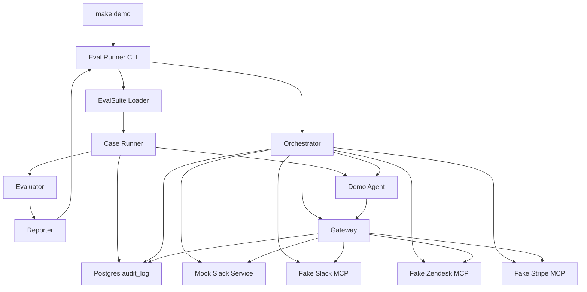
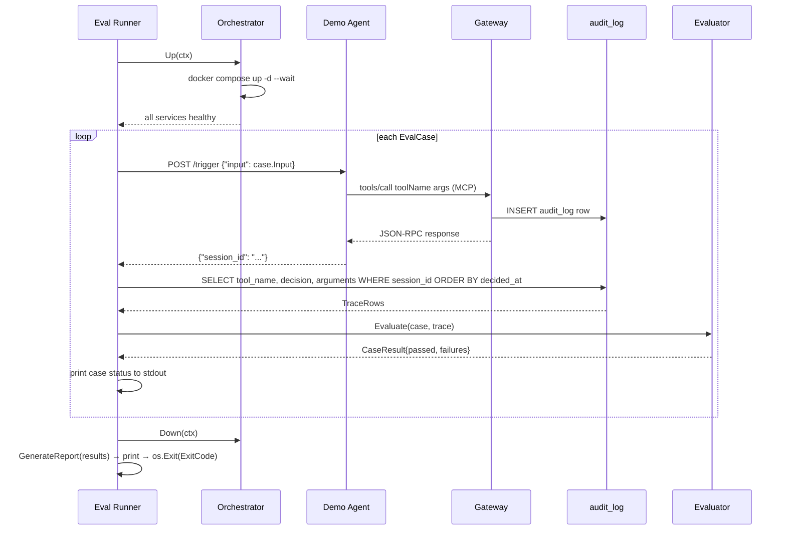
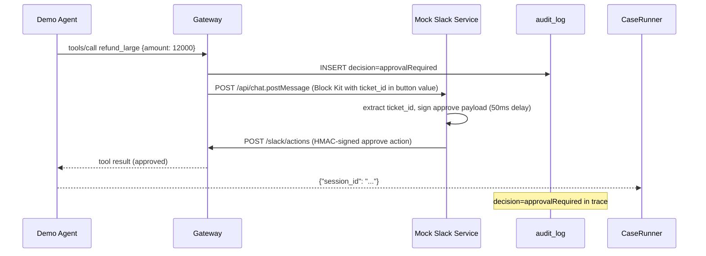

# Design Document: eval-gate

## Overview

The eval-gate feature delivers the automated deployment gate and complete demo stack for ToolGate v0. It introduces an eval runner CLI binary (`cmd/eval-runner`) that orchestrates a Docker Compose stack, submits EvalSuite YAML test cases to a Python demo agent, captures the gateway's policy decision trace from the Postgres `audit_log`, and emits a Markdown pass/fail report. A non-zero exit code on any case failure makes the runner usable as a CI gate without additional integration.

The feature also ships all v0 demo infrastructure: fake MCP servers for Stripe, Zendesk, and Slack; a mock Slack service that enables the approval scenario without a real Slack account; a Python support-refund demo agent; and a `make demo` Makefile target. Running `make demo` from a fresh git clone exercises all four gateway scenarios — auto-approve, human-approval, policy-deny, and PII-redaction — end-to-end against the real gateway binary. The eval-gate also extends the existing policy gate with an additive `redact` action that masks specified argument fields before auditing and forwarding.

**Users**: Gateway operators validating agent versions before promotion; contributors verifying the full demo stack from a fresh clone.

### Goals

- `make demo` succeeds from a fresh git clone with only Docker and Go installed
- All 4 gateway scenarios verified via EvalSuite YAML — auto-approve, approval, deny, PII-redact
- Non-zero exit code on any failure, suitable as a CI gate
- EvalSuite YAML format forward-compatible with future v2 baseline-relative fields

### Non-Goals

- Baseline-relative gating (prior version comparison)
- OTel trace diffing, trace replay, auto-suggested eval cases
- Multi-agent eval suites; Kubernetes deployment of the runner
- CI/CD runner integration beyond the exit-code convention
- LLM reasoning in the demo agent (keyword dispatch is sufficient for v0)

## Boundary Commitments

### This Spec Owns

- `cmd/eval-runner/` — entire eval runner binary
- `examples/fake-mcp-servers/` — Stripe, Zendesk, Slack fake MCP servers (Go, using go-sdk)
- `examples/mock-slack/` — mock Slack API + auto-approver service
- `examples/support-agent/` — Python demo agent with HTTP trigger endpoint
- `evalsuite/default.yaml` — default EvalSuite with 4 test cases
- `deploy/docker-compose.yml` — canonical v0 compose file covering all services
- `Makefile` — new file with `make demo` target
- `cmd/gateway/policy_gate.go` — additive `redact` action extension (new switch case only; no restructuring)
- `cmd/gateway/config.go` — additive `SLACK_API_BASE_URL` optional config field
- `policy.yaml` — `redact` rule for `send_slack_message`

### Out of Boundary

- Remaining `cmd/gateway/` logic — eval-runner consumes the gateway as a black box
- `audit_log` schema — read-only consumer; schema and write path owned by policy-gate spec
- Slack approval webhook handler and `ApprovalBridge` — owned by approval-flow spec
- Root `docker-compose.yml` — used by existing gateway E2E tests; not modified

### Allowed Dependencies

- Existing `audit_log` table (read-only queries via pgx/v5)
- `github.com/modelcontextprotocol/go-sdk v1.6.0` (already in go.mod)
- `gopkg.in/yaml.v3 v3.0.1` (already in go.mod)
- `github.com/jackc/pgx/v5 v5.9.2` (already in go.mod)
- `docker compose` CLI v2.1+ via `os/exec` (no new Go dependency)
- Python `mcp` SDK v1.x and `flask` v3.x (demo agent only)

### Revalidation Triggers

- Changes to `audit_log` column names, types, or ordering — CaseRunner queries specific columns
- MCP protocol version change — fake servers and demo agent must be updated to match
- Policy YAML format changes adding new required rule fields — breaks existing `policy.yaml`
- Gateway `SlackNotifier` base URL no longer driven by `SLACK_API_BASE_URL` — mock Slack integration breaks

## Architecture

### Architecture Pattern

Sequential pipeline CLI with layered stack orchestration. The eval-runner runs cases sequentially: load suite → bring up stack → for each case (trigger → trace capture → evaluate) → tear down stack → report. No concurrency within the runner; parallelism exists within the Docker Compose stack itself.



### Technology Stack

| Layer | Choice | Version | Role |
|-------|--------|---------|------|
| CLI binary | Go | 1.25 | Eval runner (`cmd/eval-runner`) |
| YAML parsing | `gopkg.in/yaml.v3` | 3.0.1 | EvalSuite loader (already in go.mod) |
| Database | `github.com/jackc/pgx/v5` | 5.9.2 | `audit_log` trace queries (already in go.mod) |
| Stack lifecycle | `docker compose` CLI via `os/exec` | v2.1+ | Zero new Go deps; `--wait` handles health checks |
| MCP servers | `github.com/modelcontextprotocol/go-sdk` | 1.6.0 | Fake MCP server protocol (already in go.mod) |
| Report | Go `text/template` | stdlib | Markdown report generation |
| Demo agent language | Python | 3.12 | Support-refund agent |
| Demo agent MCP | `mcp` Python SDK | 1.x | MCP client over Streamable HTTP |
| Demo agent HTTP | `flask` | 3.x | `/trigger` endpoint for eval-runner |

## File Structure Plan

```
cmd/eval-runner/
├── main.go          # Entry point: arg parsing, run orchestration, exit code
├── config.go        # Config struct: POSTGRES_DSN, EVAL_COMPOSE_FILE, AGENT_URL
├── suite.go         # EvalCase / EvalSuite structs; LoadSuite(path) func
├── orchestrator.go  # Orchestrator: docker compose up/down via os/exec
├── runner.go        # CaseRunner: POST /trigger, query audit_log
├── evaluator.go     # Evaluate(EvalCase, []TraceRow) CaseResult — pure func
└── reporter.go      # GenerateReport([]CaseResult) string; ExitCode()

examples/
├── fake-mcp-servers/
│   ├── stripe/
│   │   ├── main.go      # Tools: create_charge, get_customer
│   │   └── Dockerfile
│   ├── zendesk/
│   │   ├── main.go      # Tools: create_ticket, close_ticket
│   │   └── Dockerfile
│   └── slack/
│       ├── main.go      # Tool: send_slack_message; GET /inspect for diagnostics
│       └── Dockerfile
├── mock-slack/
│   ├── main.go          # POST /api/chat.postMessage → auto-approve → POST /slack/actions
│   └── Dockerfile
└── support-agent/
    ├── agent.py         # Flask /trigger endpoint + mcp client keyword dispatch
    ├── requirements.txt # mcp[cli], flask
    └── Dockerfile

evalsuite/
└── default.yaml         # 4 test cases (allow, approvalRequired, deny, redact)

deploy/
└── docker-compose.yml   # All v0 services incl. fake servers, mock-slack, demo agent

Makefile                 # make demo target

# Modified files:
cmd/gateway/policy_gate.go  # Add case "redact" to existing action switch
cmd/gateway/config.go       # Add SLACK_API_BASE_URL string field (optional, default https://slack.com/api)
policy.yaml                 # Add redact rule for send_slack_message
```

## System Flows

### Full Eval Run



### Approval Scenario (Mock Slack Auto-Approve)



## Requirements Traceability

| Requirement | Summary | Component | File |
|---|---|---|---|
| 1.1 | Load EvalSuite from CLI-supplied path | EvalSuiteLoader | `suite.go` |
| 1.2 | EvalCase fields: name, input, mustInclude, mustNotInclude, policyOutcome, mustNotContainInArgs | EvalSuiteLoader | `suite.go` |
| 1.3 | Parse error → diagnostic + non-zero exit, no cases run | EvalSuiteLoader, main.go | `suite.go`, `main.go` |
| 1.4 | Unknown YAML fields silently ignored | EvalSuiteLoader | `suite.go` |
| 2.1 | Bring up all services before first case | Orchestrator | `orchestrator.go` |
| 2.2 | Wait for health checks | Orchestrator | `orchestrator.go` |
| 2.3 | Tear down on completion (pass or fail) | Orchestrator | `orchestrator.go` |
| 2.4 | Startup timeout → diagnostic + non-zero exit, no cases run | Orchestrator | `orchestrator.go` |
| 2.5 | Locate compose file without external env var (default path) | Orchestrator, Config | `orchestrator.go`, `config.go` |
| 3.1 | Buildable as `go build ./cmd/eval-runner` | CLI | `main.go` |
| 3.2 | Accept EvalSuite path as CLI arg | CLI | `main.go` |
| 3.3 | `make demo` uses default EvalSuite without operator-supplied path | Makefile, CLI | `Makefile`, `main.go` |
| 3.4 | Print per-case progress to stdout | CLI | `main.go` |
| 3.5 | Detect missing Docker binary → diagnostic + non-zero exit | Orchestrator | `orchestrator.go` |
| 4.1 | Query audit_log by session_id ordered by decided_at | CaseRunner | `runner.go` |
| 4.2 | Extract tool_name and decision per row | CaseRunner | `runner.go` |
| 4.3 | DB failure → mark case failed with diagnostic, continue | CaseRunner | `runner.go` |
| 5.1 | mustInclude subsequence check | Evaluator | `evaluator.go` |
| 5.2 | mustNotInclude set membership check | Evaluator | `evaluator.go` |
| 5.3 | policyOutcome exact match on final trace row | Evaluator | `evaluator.go` |
| 5.4 | Failed check → record check name, expected, observed | Evaluator | `evaluator.go` |
| 5.5 | All checks pass → case passed | Evaluator | `evaluator.go` |
| 6.1 | Markdown report: summary table + pass rate + per-failure details | Reporter | `reporter.go` |
| 6.2 | All pass → exit 0 | Reporter, CLI | `reporter.go`, `main.go` |
| 6.3 | Any failure → exit non-zero | Reporter, CLI | `reporter.go`, `main.go` |
| 6.4 | Final verdict as last report line | Reporter | `reporter.go` |
| 7.1 | EvalSuite includes small-refund-allow case | Default EvalSuite | `evalsuite/default.yaml` |
| 7.2 | EvalSuite includes large-refund-approvalRequired case | Default EvalSuite | `evalsuite/default.yaml` |
| 7.3 | EvalSuite includes delete-customer-deny case | Default EvalSuite | `evalsuite/default.yaml` |
| 7.4 | EvalSuite includes PII-redact case + mustNotContainInArgs check; gateway redact action | Default EvalSuite, PolicyGate extension | `evalsuite/default.yaml`, `policy_gate.go` |
| 7.5 | `make demo` passes with correct stack | All components | all |
| 8.1 | Fake servers speak MCP JSON-RPC-over-SSE (Streamable HTTP) | Fake MCP Servers | `examples/fake-mcp-servers/*/main.go` |
| 8.2 | Canned deterministic responses for all EvalSuite tools | Fake MCP Servers | `examples/fake-mcp-servers/*/main.go` |
| 8.3 | Docker images buildable from repo without external credentials | Fake MCP Server Dockerfiles | `examples/fake-mcp-servers/*/Dockerfile` |
| 8.4 | Unrecognized tool → JSON-RPC error response | Fake MCP Servers | `examples/fake-mcp-servers/*/main.go` |
| 9.1 | Demo agent connects via MCP client protocol | Demo Agent | `examples/support-agent/agent.py` |
| 9.2 | Agent calls correct tools per scenario | Demo Agent | `examples/support-agent/agent.py` |
| 9.3 | Docker image buildable from repo | Demo Agent | `examples/support-agent/Dockerfile` |
| 9.4 | HTTP trigger endpoint for eval-runner | Demo Agent | `examples/support-agent/agent.py` |
| 10.1 | `make demo` works with Docker + Go only | Makefile, all Dockerfiles | `Makefile` |
| 10.2 | No real Slack token for allow/deny/redact cases | Compose, Mock Slack | `deploy/docker-compose.yml` |
| 10.3 | Mock Slack satisfies approval scenario without real token | Mock Slack Service | `examples/mock-slack/` |
| 10.4 | All Docker images buildable locally | All Dockerfiles | all `Dockerfile`s |

## Components and Interfaces

### CLI Layer

#### EvalSuiteLoader

| Field | Detail |
|---|---|
| Intent | Parse and validate the EvalSuite YAML file into typed Go structs |
| Requirements | 1.1, 1.2, 1.3, 1.4 |

**Responsibilities & Constraints**
- Parses `EvalSuite.Cases []EvalCase` from YAML at the supplied path
- Validates required fields: `name`, `input`, `policyOutcome` (enum: allow, deny, approvalRequired, expired)
- Returns descriptive `error` on missing required field or YAML decode failure; caller exits non-zero without running cases
- Silently accepts unknown YAML fields (yaml.v3 default behavior; satisfies forward-compatibility req 1.4)

**Contracts**: Service [x]

**Service Interface**
```go
type EvalCase struct {
    Name                 string   `yaml:"name"`
    Input                string   `yaml:"input"`
    MustInclude          []string `yaml:"mustInclude"`
    MustNotInclude       []string `yaml:"mustNotInclude"`
    PolicyOutcome        string   `yaml:"policyOutcome"` // allow|deny|approvalRequired|expired
    MustNotContainInArgs []string `yaml:"mustNotContainInArgs"`
}

type EvalSuite struct {
    Cases []EvalCase `yaml:"cases"`
}

func LoadSuite(path string) (*EvalSuite, error)
```

**Implementation Notes**
- Do NOT set `KnownFields(true)` on the decoder — default unknown-field tolerance is the forward-compatibility mechanism
- Post-decode: validate `policyOutcome` against the four-value enum; return error naming the case and the invalid value
- Risk: yaml.v3 silently drops type-mismatched list fields; add an integration test with a wrong-type field to verify error behavior

---

#### Orchestrator

| Field | Detail |
|---|---|
| Intent | Manage Docker Compose stack lifecycle: detect Docker, bring up all services, health-check, tear down |
| Requirements | 2.1, 2.2, 2.3, 2.4, 2.5, 3.5 |

**Responsibilities & Constraints**
- Checks `docker` binary presence via `exec.LookPath("docker")` before any compose operation
- Executes `docker compose -f <path> -p <project> up -d --wait` — `--wait` blocks until all healthchecks pass or returns non-zero on timeout
- Executes `docker compose -f <path> -p <project> down -v` via `defer` after successful `Up`
- Default compose file: `deploy/docker-compose.yml` relative to the binary's working directory; overridable via `EVAL_COMPOSE_FILE` env var
- On startup failure: captures last 20 lines of combined stdout+stderr for diagnostic output

**Contracts**: Service [x]

**Service Interface**
```go
type Orchestrator struct {
    ComposeFile string
    ProjectName string
}

func NewOrchestrator(composeFile, projectName string) *Orchestrator
func (o *Orchestrator) Up(ctx context.Context) error   // returns error if Docker missing or compose fails
func (o *Orchestrator) Down(ctx context.Context) error
```

**Implementation Notes**
- `--wait` requires Docker Compose v2.1+; document minimum version in README; surface compose version in diagnostic on flag-not-found error
- Use `exec.CommandContext` to propagate context cancellation
- Risk: `down -v` removes named volumes; ensure `deploy/docker-compose.yml` uses only ephemeral volumes for the eval stack; Postgres data volume must be ephemeral

---

#### CaseRunner

| Field | Detail |
|---|---|
| Intent | Execute one test case: submit input to demo agent, wait for completion, retrieve audit trace |
| Requirements | 3.4, 4.1, 4.2, 4.3 |

**Responsibilities & Constraints**
- POSTs `{"input": case.Input}` to demo agent's `POST /trigger` with a 60s HTTP timeout
- Parses `{"session_id": "<uuid>"}` from the trigger response body
- Queries `audit_log` for all rows with that `session_id`, ordered by `decided_at ASC`
- On DB error: returns `(nil, diagnosticError)` — caller marks case failed with the error text and continues to next case
- On non-200 from agent: returns `(nil, error)` with HTTP status and first 256 bytes of body

**Contracts**: Service [x]

**Service Interface**
```go
type TraceRow struct {
    ToolName  string
    Decision  string
    Arguments json.RawMessage // JSONB decoded as raw JSON for substring checks
}

type CaseRunner struct {
    AgentBaseURL string
    DB           *pgxpool.Pool
}

func NewCaseRunner(agentBaseURL string, db *pgxpool.Pool) *CaseRunner
func (r *CaseRunner) Run(ctx context.Context, c EvalCase) ([]TraceRow, error)
```

**Implementation Notes**
- `json.RawMessage` for Arguments avoids full JSONB deserialization; Evaluator performs substring checks on the raw JSON bytes
- 60s HTTP timeout covers the full approval scenario (mock Slack auto-approves within ~1s; real Slack up to 300s — demo stack uses mock)
- The demo agent returns `session_id` only after the MCP tool call completes, so the audit_log row is guaranteed to exist at query time

---

#### Evaluator

| Field | Detail |
|---|---|
| Intent | Apply all EvalCase assertions against a captured trace; collect failures without short-circuiting |
| Requirements | 5.1, 5.2, 5.3, 5.4, 5.5 |

**Contracts**: Service [x]

**Service Interface**
```go
type CheckFailure struct {
    Check    string // "mustInclude" | "mustNotInclude" | "policyOutcome" | "mustNotContainInArgs"
    Expected string
    Observed string
}

type CaseResult struct {
    Name     string
    Passed   bool
    Failures []CheckFailure
}

func Evaluate(c EvalCase, trace []TraceRow) CaseResult
```

**Check semantics:**
- `mustInclude`: subsequence match — each item must appear in declared order as a subsequence of trace `ToolName` values; gaps allowed. O(m×n) where m=len(mustInclude), n=len(trace).
- `mustNotInclude`: set membership — no trace row's `ToolName` equals any item.
- `policyOutcome`: exact string match against the final trace row's `Decision` field. If trace is empty, Observed = "(empty trace)".
- `mustNotContainInArgs`: for each string, `strings.Contains(string(row.Arguments), s)` must be false for every trace row. Observed = first row where the string was found.

**Implementation Notes**
- Pure function — no I/O; all checks collected into `Failures` before returning
- Empty trace: fails `mustInclude` with Observed="(empty trace)" — distinct from a non-empty trace where the tool is absent
- Risk: substring scan on raw JSON may false-positive on JSON field names that match a PII string; acceptable for v0 where PII strings are chosen to avoid this

---

#### Reporter

| Field | Detail |
|---|---|
| Intent | Render Markdown pass/fail report and determine final exit code |
| Requirements | 6.1, 6.2, 6.3, 6.4 |

**Contracts**: Service [x]

**Service Interface**
```go
func GenerateReport(results []CaseResult) string // Markdown string written to stdout
func ExitCode(results []CaseResult) int           // 0 all-pass, 1 any-failure
```

**Report structure:**
1. Summary table: `| Case | Status |` for all cases
2. Pass rate line: `N/M cases passed`
3. Per-failed-case detail: case name, each CheckFailure (check | expected | observed)
4. Final verdict line (must be last): `PASS` or `FAIL: N case(s) failed`

**Implementation Notes**
- Use `text/template` for Markdown table generation
- Final verdict line enables shell scripts to check `tail -1 report.md` without parsing JSON

---

### Infrastructure Layer

#### Fake MCP Servers (Stripe, Zendesk, Slack)

All three share the same structural pattern using `github.com/modelcontextprotocol/go-sdk`. Each is a standalone Go binary in its own Dockerfile.

**Common registration pattern:**
```go
s := server.NewServer("fake-<name>", "1.0.0", nil)
tool := mcp.NewTool("tool_name", mcp.WithDescription("..."), mcp.WithSchema(...))
s.AddTool(tool, handlerFunc)
// Serve Streamable HTTP on POST /mcp
http.ListenAndServe(":PORT", mcp.NewStreamableHTTPServer(s))
```

**Tool inventory:**

| Server | Port | Tools | Canned response |
|---|---|---|---|
| Stripe | 8082 | `create_charge(amount, currency, customer_id)` | `{"id": "ch_fake_001", "status": "succeeded"}` |
| Zendesk | 8083 | `create_ticket(subject, description, customer_id)` | `{"id": "tkt_fake_001", "status": "open"}` |
| Slack | 8084 | `send_slack_message(channel, message)` | `{"ok": true}` |

**Fake Slack additional endpoint:**
```
GET /inspect
Response: {"calls": [{"tool": "send_slack_message", "arguments": {...}}, ...]}
```
Stores received `send_slack_message` arguments in an in-memory `[]map[string]any` guarded by `sync.Mutex`. Used for diagnostic inspection; the eval-runner uses audit_log for assertions, not this endpoint.

**Requirements**: 8.1, 8.2, 8.3, 8.4

**Implementation Notes**
- Unrecognized tools: go-sdk returns JSON-RPC `{"code": -32601, "message": "Method not found"}` by default — no extra handling needed
- All three Dockerfiles use `golang:1.25-alpine` builder + `scratch` or `alpine` runtime image for small images

---

#### Mock Slack Service

| Field | Detail |
|---|---|
| Intent | Simulate the Slack API for the approval scenario; auto-approve pending tickets without a real Slack account |
| Requirements | 10.2, 10.3 |

**Behavior:**
1. Exposes `POST /api/chat.postMessage` — accepts the gateway's Block Kit notification
2. Extracts `ticket_id` from the first `actions` block element's `value` field
3. Waits 50ms (avoids race with gateway's approval subscription setup)
4. Constructs a signed Slack interactive payload for action `"approval_approve"` with `value=<ticket_id>`
5. POSTs it to `GATEWAY_URL/slack/actions` with correct `X-Slack-Signature` and `X-Slack-Request-Timestamp` headers
6. Returns `{"ok": true}` to the gateway's notifier

**API endpoint:**
```
POST /api/chat.postMessage
Authorization: Bearer <any token>
Body: Slack chat.postMessage JSON payload
Response: {"ok": true}
```

**Configuration:**
- `GATEWAY_URL` — URL of the gateway (e.g., `http://gateway:8080`)
- `SLACK_SIGNING_SECRET` — must match the gateway's `SLACK_SIGNING_SECRET`

**Contracts**: API [x]

**Implementation Notes**
- Signs payload using HMAC-SHA256 matching the gateway's `SlackWebhookHandler` verification algorithm — use the same signing logic extracted to a shared function or replicate it in mock-slack/main.go
- The gateway's `SlackNotifier` base URL is set via `SLACK_API_BASE_URL=http://mock-slack:8090/api` in `deploy/docker-compose.yml`
- Risk: if the signing secret is wrong, gateway rejects with HTTP 400 and the approval never completes — the eval case times out with `policyOutcome: expired` instead of `approvalRequired`; detected immediately in testing

---

#### Demo Agent (Python)

| Field | Detail |
|---|---|
| Intent | Python support-refund agent that connects to the gateway via MCP and exposes an HTTP trigger endpoint for the eval-runner |
| Requirements | 9.1, 9.2, 9.3, 9.4 |

**HTTP trigger endpoint:**
```
POST /trigger
Request body:  {"input": "<keyword>"}
Response body: {"session_id": "<uuid>"}   (returned after MCP tool call completes)
HTTP 400 if input keyword is unknown
```

**Tool dispatch table:**

| Input keyword | Tool called | Arguments |
|---|---|---|
| `small-refund` | `refund_small` | `{"amount": 50, "customer_id": "cust_001"}` |
| `large-refund` | `refund_large` | `{"amount": 12000, "customer_id": "cust_002"}` |
| `delete-customer` | `delete_record` | `{"customer_id": "cust_003"}` |
| `slack-pii-message` | `send_slack_message` | `{"channel": "#support", "message": "Customer SSN: 123-45-6789"}` |

**Implementation (simplified):**
```python
from mcp.client.streamable_http import streamablehttp_client
from mcp import ClientSession
from flask import Flask, request, jsonify
import uuid, os

app = Flask(__name__)
GATEWAY_URL = os.environ["GATEWAY_URL"]

@app.post("/trigger")
def trigger():
    input_key = request.json["input"]
    tool, args = DISPATCH[input_key]   # KeyError → 400
    session_id = str(uuid.uuid4())
    with streamablehttp_client(GATEWAY_URL,
                               headers={"Mcp-Session-Id": session_id}) as (r, w, _):
        async with ClientSession(r, w) as session:
            await session.initialize()
            await session.call_tool(tool, args)
    return jsonify({"session_id": session_id})
```

**Contracts**: API [x]

**Implementation Notes**
- `Mcp-Session-Id` header on every request scopes all tool calls to one session — allows CaseRunner to query `audit_log WHERE session_id = ?`
- Flask serves `/trigger` synchronously; for the approval scenario, the `call_tool` call blocks until the gateway returns the approved result (via mock Slack)
- Risk: Python MCP SDK header injection — verify `streamablehttp_client` accepts a `headers` kwarg; if not, use a custom `httpx.Client` with the header set
- Demo agent is a v0 stub; v1+ will replace keyword dispatch with a real LLM agent

---

### Gateway Extension

#### PolicyGate `redact` Action

| Field | Detail |
|---|---|
| Intent | Extend policy_gate.go with a `redact` action that masks specified argument fields before auditing and forwarding |
| Requirements | 7.4 |

**Policy YAML extension:**
```yaml
rules:
  - tool: send_slack_message
    action: redact
    redactFields: ["message"]
```

**Behavior:**
1. New `case "redact":` in the existing `PolicyGateHandler.Handle()` action switch
2. Deep-copies `req.Params.Arguments`; replaces each field in `redactFields` with the string `"***REDACTED***"`
3. Calls `auditWriter.Write()` with `decision="allow"` and the post-redaction arguments
4. Sets `req.Params.Arguments` to the masked copy; returns `(nil, nil)` to let `UpstreamForwarder` forward the redacted request

**Rule struct extension:**
```go
type Rule struct {
    Tool         string   `yaml:"tool"`
    Action       string   `yaml:"action"`     // allow|deny|approvalRequired|redact
    RedactFields []string `yaml:"redactFields"` // optional; only used when action=redact
}
```

**`SLACK_API_BASE_URL` config extension:**
```go
// cmd/gateway/config.go
SlackAPIBaseURL string // SLACK_API_BASE_URL env var; default "https://slack.com/api"
```
`SlackNotifier` uses this field as the API base instead of the hardcoded string.

**Contracts**: Service [x]

**Implementation Notes**
- `RedactFields` is optional; existing policy.yaml files without it remain valid (yaml.v3 defaults the field to nil)
- Deep-copy before mutation: arguments map must not be mutated in place since the original `req` value may be referenced by logging middleware
- Audit writes redacted arguments (what was forwarded), not originals — this is intentional: the audit trail reflects what left the gateway
- Risk: if `redactFields` names a field that doesn't exist in `arguments`, silently skip it (no error — the field was already absent)

## Data Models

### EvalSuite YAML Schema

```yaml
# evalsuite/default.yaml
cases:
  - name: small-refund-allow
    input: small-refund
    mustInclude: [refund_small]
    policyOutcome: allow

  - name: large-refund-approval
    input: large-refund
    mustInclude: [refund_large]
    policyOutcome: approvalRequired

  - name: delete-customer-deny
    input: delete-customer
    mustInclude: [delete_record]
    policyOutcome: deny

  - name: slack-pii-redact
    input: slack-pii-message
    mustInclude: [send_slack_message]
    policyOutcome: allow
    mustNotContainInArgs: ["123-45-6789"]
```

### audit_log Read Contract (existing schema, read-only)

```sql
-- CaseRunner query (read-only)
SELECT tool_name, decision, arguments
FROM audit_log
WHERE session_id = $1
ORDER BY decided_at ASC;
```

No schema changes. When the gateway applies a `redact` action, the `arguments` column stores the post-redaction values — this is the guarantee that enables `mustNotContainInArgs` to verify PII absence.

## Error Handling

### Error Strategy

Fail fast on configuration and startup errors; continue on per-case runtime failures to produce a complete report.

| Category | Scenario | Response |
|---|---|---|
| Config | `POSTGRES_DSN` absent | Print error + exit non-zero before compose up |
| Config | Docker binary not found | Print diagnostic ("docker not found in PATH") + exit non-zero |
| Parse | Invalid EvalSuite YAML | Print file path + first parse error + exit non-zero; no cases run |
| Startup | Compose up fails or health timeout | Print last 20 lines of compose stderr + exit non-zero; no cases run |
| Runtime | Agent `/trigger` returns non-200 | Mark case failed with HTTP status + first 256 bytes of body; continue |
| Runtime | DB query fails | Mark case failed with connection error message; continue |
| Runtime | Empty trace | Evaluator fails `mustInclude` with Observed="(empty trace)"; case recorded as failed |
| Runtime | Unknown input keyword (agent) | Agent returns HTTP 400; CaseRunner records failure; continue |

### Monitoring

- Per-case status (running / PASS / FAIL) printed to stdout as each case executes (req 3.4)
- Final Markdown report printed to stdout; shell-redirectable (`make demo > report.md 2>&1`)
- No persistent logging infrastructure required for v0

## Testing Strategy

### Unit Tests

- **EvalSuiteLoader**: valid YAML with all fields loads correctly; unknown fields ignored; missing `policyOutcome` returns descriptive error; empty `cases` list accepted; invalid `policyOutcome` value returns error naming the case
- **Evaluator**: mustInclude subsequence match (exact, gapped, out-of-order fails, empty trace); mustNotInclude rejection (present → fail, absent → pass); policyOutcome exact match (correct, wrong, empty trace); mustNotContainInArgs (absent → pass, present → fail with observed row); all checks collected before returning (no short-circuit)
- **Reporter**: all-pass → exit 0 + "PASS" final line; one failure → exit 1 + "FAIL: 1 case(s) failed"; summary table contains all case names

### Integration Tests

- **CaseRunner** with testcontainers Postgres: pre-insert known `audit_log` rows for a session_id; verify `Run()` returns them in declared order with correct `tool_name`, `decision`, and raw `arguments`
- **Orchestrator** (CI-only, requires Docker): `Up()` + `Down()` cycle with a minimal 1-service compose file completes without error; missing Docker binary returns descriptive error before any compose call

### E2E Tests

- `make demo` against full stack: all 4 cases pass, exit code 0, report contains "PASS" final line
- Broken policy (deny `refund_small`): allow case fails, exit code 1, failure details include `policyOutcome` check with Expected=allow Observed=deny
- Mock Slack auto-approve: approval case completes with `policyOutcome: approvalRequired` in trace within 10 seconds of trigger

## Security Considerations

- `SLACK_SIGNING_SECRET` is shared between the gateway and the mock Slack service via `deploy/docker-compose.yml`; this file must not be committed with real production secrets — it uses a dummy value for the demo stack
- Demo agent hardcodes dummy customer IDs and a synthetic SSN (`123-45-6789`) — no real PII; this is documented in the agent's README
- Fake MCP servers have no authentication; `deploy/docker-compose.yml` isolates them to the internal Docker bridge network with no published ports other than those required for gateway access
