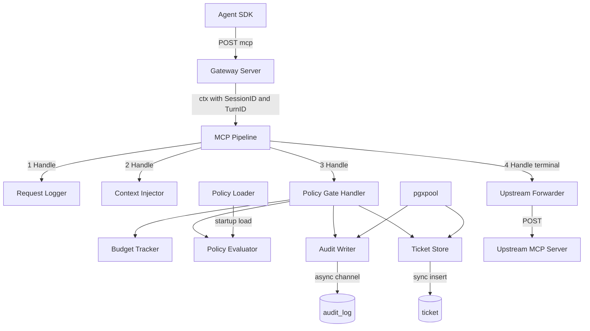
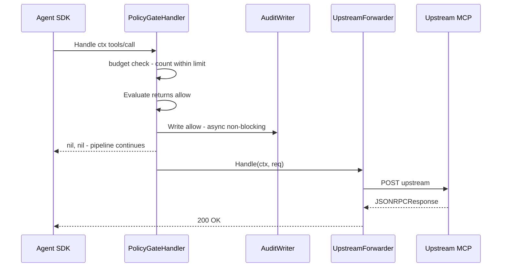
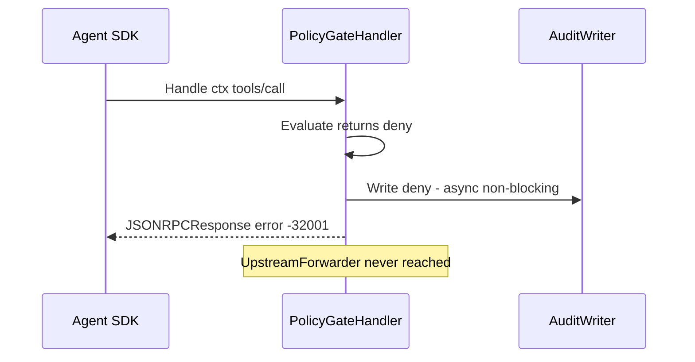
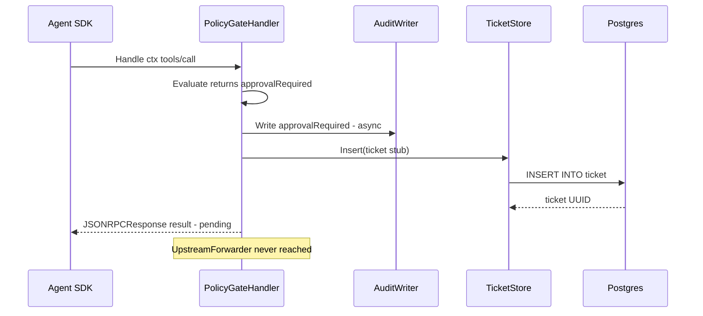
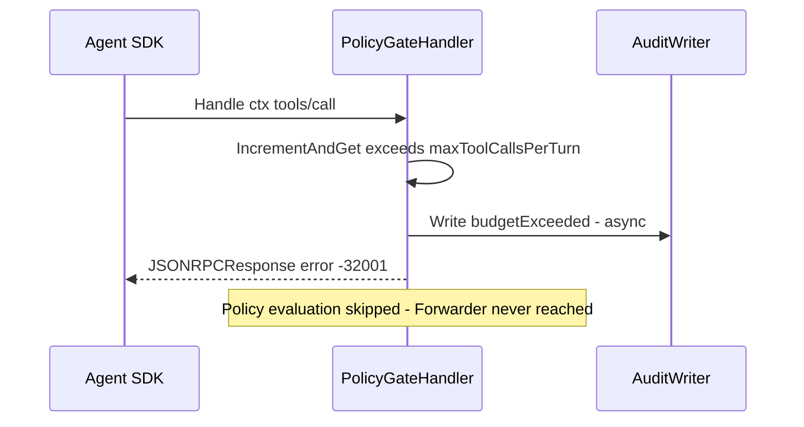

# Design Document: policy-gate

## Overview

The policy-gate slice extends the bare-proxy pipeline with synchronous, in-process enforcement. Every `tools/call` JSON-RPC request is evaluated against an operator-configured YAML `AgentPolicy` before being forwarded; the result is forwarded transparently (allow), rejected with a structured error (deny), or held as a pending ticket (approvalRequired). Every decision is durably recorded to a Postgres `audit_log` table before the response is returned.

**Purpose**: This slice enforces deterministic allow / deny / approvalRequired decisions on AI agent tool invocations, ensuring no tool call reaches the upstream MCP server without policy authorization and an audit trail.

**Users**: Gateway operators configure `AgentPolicy` YAML rules and monitor the `audit_log`. AI agent SDKs (LangGraph, CrewAI) receive enforcement signals transparently — allow decisions are invisible on the happy path.

**Impact**: Extends the bare-proxy pipeline (slice 1) by registering a `PolicyGateHandler` before the `UpstreamForwarder`, and introduces Postgres as a required infrastructure dependency for audit durability and ticket stub insertion.

### Goals

- Enforce allow / deny / approvalRequired decisions on every `tools/call` before upstream forwarding
- Record every decision durably to Postgres with full context (session, turn, tool, arguments, decision, timestamp)
- Cap per-turn tool-call volume via `maxToolCallsPerTurn` budget
- Insert ticket stub rows for approvalRequired decisions with a schema compatible with slice 4 (approval-flow)
- Fail fast at startup when policy YAML or Postgres is misconfigured

### Non-Goals

- Approval notification, routing, or request resumption (slice 4)
- Redis session locking or turn serialization (slice 3)
- PII redaction from tool arguments
- Policy hot-reload or file-watching
- Rego / CEL policy backends
- Rate limiting beyond per-turn tool-call budget

---

## Boundary Commitments

### This Spec Owns

- `AgentPolicy` YAML loading and strict validation at startup
- In-process policy evaluation on every `tools/call` (ordered rule matching, defaultAction fallback)
- Per-turn tool-call budget tracking (in-memory counter)
- `audit_log` Postgres table schema definition and all writes to it
- `ticket` Postgres table schema definition and stub row insertion for approvalRequired decisions
- Postgres connection pool initialization and startup health check
- `PolicyGateHandler` registration into the existing bare-proxy `Pipeline`
- Extension of `Config` with `POLICY_FILE` and `POSTGRES_DSN` environment variables
- Addition of `CodePolicyDenied = -32001` constant to `core/mcp/types.go`
- Docker Compose `postgres` service definition and gateway Postgres environment variable wiring

### Out of Boundary

- Reading or updating `ticket` rows after insertion — slice 4 (approval-flow) owns ticket lifecycle
- Approval notification (Slack), approval-state polling, or request resumption — slice 4
- Redis mutex or per-session RWLock — slice 3 (session-mgmt)
- PII redaction from `arguments` before Postgres storage
- Multi-tenant isolation or per-tenant policy scoping

### Allowed Dependencies

- `core/mcp` — `Handler`, `Pipeline`, `JSONRPCRequest`, `JSONRPCResponse`, `NewErrorResponse`, context key helpers (`SessionIDFromContext`, `TurnIDFromContext`)
- `cmd/gateway/config.go` — `Config` struct (policy-gate adds two fields)
- `cmd/gateway/main.go` — wiring point for `PolicyGateHandler` into the pipeline
- `gopkg.in/yaml.v3` — YAML decoding with strict field validation
- `github.com/jackc/pgx/v5` and `pgxpool` — Postgres connection pool and query execution

### Revalidation Triggers

Changes that force dependent specs (session-mgmt, approval-flow) to re-check their integration:

- `audit_log` or `ticket` column names, types, or constraints changed
- `ticket.status` CHECK constraint values changed — slice 4 reads and writes `status`
- `ticket.expires_at` semantics changed — slice 4 relies on this for its 5-minute timeout poller
- `CodePolicyDenied` constant value or deny JSON-RPC error response shape changed
- `PolicyGateHandler` registration position in the pipeline changed (must run after `ContextInjector`, before `UpstreamForwarder`)
- `Handler` interface changed in `core/mcp` (bare-proxy revalidation trigger propagates here)

---

## Architecture

### Architecture Pattern

Policy-gate follows the same **layered pipeline** architecture as bare-proxy, registering one new handler before the terminal forwarder and adding two Postgres-backed stores.



**Dependency direction** (innermost → outermost; no reverse imports):

```
core/mcp  (types, pipeline, handler, forwarder)
core/policy  (AgentPolicy types, loader, evaluator — no DB, no HTTP)
    ↑
cmd/gateway  (PolicyGateHandler, BudgetTracker, AuditWriter, TicketStore, DB pool, Config, wiring)
```

`core/policy` imports only Go stdlib and `gopkg.in/yaml.v3`. It has no knowledge of Postgres, HTTP, or the gateway Config. `cmd/gateway` imports both `core/mcp` and `core/policy`.

**Pipeline registration order** (enforced in `main.go`):

1. `RequestLogger` — logs method, sessionId, turnId before any mutation
2. `ContextInjector` — injects `_meta.sessionId` and `_meta.turnId` into params
3. `PolicyGateHandler` — budget check → policy evaluation → audit → dispatch _(new)_
4. `UpstreamForwarder` (terminal) — reached only on allow decisions

### Technology Stack

| Layer | Choice / Version | Role |
|-------|-----------------|------|
| Language | Go 1.22+ | All gateway and policy logic |
| YAML parsing | `gopkg.in/yaml.v3` | AgentPolicy loading; `KnownFields(true)` for strict field rejection |
| Postgres client | `github.com/jackc/pgx/v5` + `pgxpool` | Connection pool; audit and ticket inserts |
| In-memory budget | `sync.Mutex` + `map[string]int` | Per-(sessionID, turnID) tool-call counter; write-heavy ephemeral keys |
| Audit delivery | Buffered channel (cap 256) + goroutine worker | Non-blocking fire-and-forget audit writes |
| Infrastructure | Docker Compose (`postgres:16`) | Postgres service for local dev and demo |

---

## File Structure Plan

```
agentplane/
├── core/
│   ├── mcp/
│   │   └── types.go           # MODIFIED: add CodePolicyDenied = -32001
│   └── policy/
│       ├── policy.go           # AgentPolicy, PolicyRule, Action, Budgets, PolicyDecision types
│       └── evaluator.go        # LoadPolicy (YAML load + validate), Evaluate (ordered rule match)
│
├── cmd/
│   └── gateway/
│       ├── main.go             # MODIFIED: DB pool init, policy load, PolicyGateHandler wiring
│       ├── config.go           # MODIFIED: add PolicyFilePath, PostgresDSN fields
│       ├── db.go               # NewDBPool (pgxpool), MigrateSchema (CREATE TABLE IF NOT EXISTS)
│       ├── policy_gate.go      # PolicyGateHandler (Handler impl) + BudgetTracker
│       ├── audit.go            # AuditRecord struct, AuditWriter (channel + goroutine worker)
│       └── ticket.go           # TicketRecord struct, TicketStore (Postgres insert)
│
└── docker-compose.yml          # CREATED: gateway + postgres services
```

### Modified Files

- `core/mcp/types.go` — Add `CodePolicyDenied = -32001` alongside existing error code constants
- `cmd/gateway/main.go` — Add DB pool construction (`NewDBPool`), schema migration (`MigrateSchema`), policy loading (`LoadPolicy`), `PolicyGateHandler` construction, and `pipeline.Use(policyGate)` call before `pipeline.Use(forwarder)` was set as terminal
- `cmd/gateway/config.go` — Add `PolicyFilePath string` (env: `POLICY_FILE`, default `"policy.yaml"`) and `PostgresDSN string` (env: `POSTGRES_DSN`, required — startup fails if empty)

---

## System Flows

### tools/call — Allow Decision



### tools/call — Deny Decision



### tools/call — Approval Required



### tools/call — Budget Exceeded



---

## Requirements Traceability

| Requirement | Summary | Component(s) | Interface / Contract |
|-------------|---------|--------------|---------------------|
| 1.1 | Load policy from POLICY_FILE env var | `Config`, `PolicyLoader` | `Config.PolicyFilePath`; `LoadPolicy(path)` |
| 1.2 | Default path with log notice if env unset | `Config`, `PolicyLoader` | Default `"policy.yaml"`; `slog.Info` notice at startup |
| 1.3 | Refuse to start if file not found | `PolicyLoader`, `main.go` | `LoadPolicy()` returns error → `log.Fatalf` |
| 1.4 | Refuse to start if YAML invalid or unknown fields | `PolicyLoader` | `dec.KnownFields(true)` + post-decode validation |
| 1.5 | YAML supports rules, budgets, defaultAction | `AgentPolicy`, `PolicyRule`, `Budgets` | Struct tags; `Action` constants |
| 2.1 | Non-tools/call passthrough without evaluation | `PolicyGateHandler` | `Handle()` returns `nil, nil` on `req.Method != "tools/call"` |
| 3.1 | Evaluate tools/call before forwarding | `PolicyGateHandler` | `Handle()` calls `Evaluate()` and dispatches before returning `nil, nil` |
| 3.2 | Access to sessionID and turnID during evaluation | `PolicyGateHandler` | `mcp.SessionIDFromContext(ctx)`, `mcp.TurnIDFromContext(ctx)` |
| 3.3 | First matching rule determines decision | `PolicyEvaluator` | `Evaluate()` iterates `policy.Rules` in order; returns on first match |
| 3.4 | Default action applied when no rule matches | `PolicyEvaluator` | Returns `PolicyDecision{Action: policy.DefaultAction}` on no match |
| 4.1 | Allow → forward to upstream transparently | `PolicyGateHandler` | Returns `nil, nil`; pipeline continues to `UpstreamForwarder` |
| 5.1 | Deny → -32001 error; upstream not reached | `PolicyGateHandler` | Returns `NewErrorResponse(req.ID, CodePolicyDenied, "denied by policy")` |
| 5.2 | Upstream not contacted on deny | `PolicyGateHandler`, `Pipeline` | Non-nil response halts `Pipeline.Run()`; `UpstreamForwarder.Handle()` not called |
| 6.1 | ApprovalRequired → synthetic pending response | `PolicyGateHandler` | Returns `JSONRPCResponse{Result: pendingResult}` without forwarding |
| 6.2 | Insert ticket record on approvalRequired | `TicketStore` | `TicketStore.Insert(ctx, TicketRecord)` writes to `ticket` table |
| 6.3 | Upstream not contacted on approvalRequired | `PolicyGateHandler`, `Pipeline` | Same halt mechanism as deny |
| 7.1 | Track tools/call count per (sessionID, turnID) | `BudgetTracker` | `map[string]int` keyed `sessionID+":"+turnID`; mutex-guarded |
| 7.2 | Deny with -32001 when budget exceeded | `PolicyGateHandler`, `BudgetTracker` | `IncrementAndGet() > max` → return error before policy evaluation |
| 7.3 | Audit record for budget-exceeded denial | `AuditWriter` | `Write(AuditRecord{Decision: "budgetExceeded"})` called before return |
| 8.1 | Audit record for every decision | `AuditWriter` | `Write()` called in every branch of `Handle()` before the return |
| 8.2 | Record: sessionID, turnID, toolName, args, decision, timestamp | `AuditRecord`, `audit_log` | `AuditRecord` struct fields; `decided_at DEFAULT NOW()` in schema |
| 8.3 | Audit failure does not block or delay response | `AuditWriter` | Buffered channel; `select { case ch <- r: default: warn }` |
| 8.4 | Require reachable Postgres at startup | `DB`, `main.go` | `pgxpool.New()` + `pool.Ping()` before `server.ListenAndServe()` |
| 9.1 | Validate policy file + Postgres before serving | `main.go` startup sequence | `LoadPolicy()` → `NewDBPool()` → `MigrateSchema()` → `ListenAndServe()` |
| 9.2 | Exit non-zero with human-readable error on failure | `main.go` | `log.Fatalf("policy-gate: %v", err)` on any startup check failure |

---

## Components and Interfaces

### Summary Table

| Component | Layer | Intent | Req Coverage | Key Dependencies |
|-----------|-------|--------|--------------|-----------------|
| `AgentPolicy` / `PolicyRule` / `Action` / `Budgets` | `core/policy` | YAML domain types | 1.5, 3.3, 3.4 | none |
| `PolicyLoader` | `core/policy` | Load and validate `AgentPolicy` from YAML | 1.1–1.4 | `yaml.v3` |
| `PolicyEvaluator` | `core/policy` | Ordered rule match; default action fallback | 3.1, 3.3, 3.4, 4.1, 5.1, 6.1 | `AgentPolicy` |
| `PolicyGateHandler` | `cmd/gateway` | Single pipeline handler: budget + evaluate + audit + ticket | 2.1, 3.1–3.2, 4.1, 5.1–5.2, 6.1–6.3, 7.1–7.3, 8.1 | `core/policy`, `BudgetTracker`, `AuditWriter`, `TicketStore` |
| `BudgetTracker` | `cmd/gateway` | Per-(sessionID, turnID) in-memory call counter | 7.1, 7.2 | `sync.Mutex`, `map[string]int` |
| `AuditWriter` | `cmd/gateway` | Non-blocking async Postgres audit log writer | 8.1–8.3 | `pgxpool`, buffered channel |
| `TicketStore` | `cmd/gateway` | Synchronous Postgres ticket stub insertion | 6.2 | `pgxpool` |
| `DB` (pool + migration) | `cmd/gateway` | Postgres connection pool; idempotent schema migration | 8.4, 9.1 | `pgxpool` |
| `Config` (extended) | `cmd/gateway` | POLICY_FILE and POSTGRES_DSN env vars | 1.1, 1.2, 8.4 | none |

---

### core/policy

#### AgentPolicy Types

| Field | Detail |
|-------|--------|
| Intent | Typed representation of the YAML policy configuration |
| Requirements | 1.5, 3.3, 3.4 |

**Contracts**: Service [x]

```go
// core/policy/policy.go

type Action string

const (
    ActionAllow            Action = "allow"
    ActionDeny             Action = "deny"
    ActionApprovalRequired Action = "approvalRequired"
)

type PolicyRule struct {
    Tool   string `yaml:"tool"`
    Action Action `yaml:"action"`
}

type Budgets struct {
    MaxToolCallsPerTurn int `yaml:"maxToolCallsPerTurn"`
}

type AgentPolicy struct {
    Rules         []PolicyRule `yaml:"rules"`
    Budgets       Budgets      `yaml:"budgets"`
    DefaultAction Action       `yaml:"defaultAction"`
}

// PolicyDecision is the outcome of evaluating a single tool call against an AgentPolicy.
type PolicyDecision struct {
    Action Action
}
```

- Invariant: `AgentPolicy.DefaultAction` must be `ActionAllow` or `ActionDeny` (validated post-decode; `ActionApprovalRequired` is not valid as a default).
- Invariant: each `PolicyRule.Tool` must be a non-empty string and `PolicyRule.Action` one of the three defined constants (validated post-decode).

---

#### PolicyLoader

| Field | Detail |
|-------|--------|
| Intent | Load `AgentPolicy` from a YAML file; reject unknown fields, invalid actions, and missing files at startup |
| Requirements | 1.1, 1.2, 1.3, 1.4 |

**Contracts**: Service [x]

```go
// core/policy/evaluator.go

// LoadPolicy reads the file at path and decodes it as an AgentPolicy.
// Returns error if the file is missing, YAML is malformed, contains unknown
// fields, or fails post-decode validation (invalid Action values, empty tool names).
func LoadPolicy(path string) (*AgentPolicy, error)
```

- Postcondition: returned `*AgentPolicy` is fully valid for use in `Evaluate()`.
- Uses `yaml.NewDecoder(f)` with `dec.KnownFields(true)` followed by a validation pass over all `Action` fields.

---

#### PolicyEvaluator

| Field | Detail |
|-------|--------|
| Intent | Evaluate a tool name against a loaded `AgentPolicy`; return the first matching rule's action or `defaultAction` |
| Requirements | 3.1, 3.3, 3.4, 4.1, 5.1, 6.1 |

**Contracts**: Service [x]

```go
// core/policy/evaluator.go

// Evaluate returns the PolicyDecision for toolName against policy.
// Rules are evaluated in slice order; the first rule whose Tool matches
// toolName (exact string equality) determines the result.
// If no rule matches, policy.DefaultAction is returned.
func Evaluate(policy *AgentPolicy, toolName string) PolicyDecision
```

- Precondition: `policy` is non-nil and was returned from `LoadPolicy` (already validated).
- Postcondition: always returns a valid `PolicyDecision`; never errors.
- v0 rule matching: exact string equality between `toolName` and `PolicyRule.Tool`.

---

### cmd/gateway

#### PolicyGateHandler

| Field | Detail |
|-------|--------|
| Intent | Pipeline `Handler` implementation that enforces the full policy gate: budget check → policy evaluation → audit → decision dispatch |
| Requirements | 2.1, 3.1, 3.2, 4.1, 5.1, 5.2, 6.1, 6.2, 6.3, 7.1, 7.2, 7.3, 8.1 |

**Contracts**: Service [x]

```go
// cmd/gateway/policy_gate.go

type PolicyGateHandler struct {
    policy  *corepolicy.AgentPolicy
    budget  *BudgetTracker
    audit   *AuditWriter
    tickets *TicketStore
    log     *slog.Logger
}

func NewPolicyGateHandler(
    policy  *corepolicy.AgentPolicy,
    budget  *BudgetTracker,
    audit   *AuditWriter,
    tickets *TicketStore,
    log     *slog.Logger,
) *PolicyGateHandler

func (h *PolicyGateHandler) Handle(ctx context.Context, req *mcp.JSONRPCRequest) (*mcp.JSONRPCResponse, error)
```

**`Handle()` execution sequence**:

1. `req.Method != "tools/call"` → return `nil, nil` (passthrough, req 2.1)
2. Extract `sessionID` from `mcp.SessionIDFromContext(ctx)`, `turnID` from `mcp.TurnIDFromContext(ctx)`
3. Parse `toolName` from `req.Params` (`params.name`); parse `arguments` as `json.RawMessage`; malformed params → return `(nil, fmt.Errorf(...))` triggering `-32603`
4. `count := h.budget.IncrementAndGet(sessionID, turnID)`. If `count > policy.Budgets.MaxToolCallsPerTurn` → `h.audit.Write(AuditRecord{Decision: "budgetExceeded"})` → return `NewErrorResponse(req.ID, CodePolicyDenied, "tool-call budget exceeded")` (req 7.2, 7.3)
5. `decision := corepolicy.Evaluate(h.policy, toolName)`
6. `h.audit.Write(AuditRecord{SessionID, TurnID, ToolName, Arguments, Decision: string(decision.Action)})` (req 8.1, always before return)
7. Switch on `decision.Action`:
   - `ActionAllow` → return `nil, nil` (req 4.1)
   - `ActionDeny` → return `NewErrorResponse(req.ID, CodePolicyDenied, "denied by policy")` (req 5.1)
   - `ActionApprovalRequired` → `h.tickets.Insert(ctx, TicketRecord{...})`; log WARN on error; return pending `JSONRPCResponse` (req 6.1, 6.2)

**Pending response shape** (req 6.1):
```json
{
  "jsonrpc": "2.0",
  "id": "<original id>",
  "result": {
    "status": "pending",
    "message": "tool call requires human approval"
  }
}
```

**Implementation Notes**
- Integration: registered via `pipeline.Use(policyGate)` in `main.go` after `ContextInjector` and before the terminal `UpstreamForwarder`.
- Risks: In-memory budget counter resets on gateway restart. Acceptable for v0 demo; Redis in slice 3 replaces this.

---

#### BudgetTracker

| Field | Detail |
|-------|--------|
| Intent | Mutex-guarded in-memory counter for tools/call count per (sessionID, turnID) pair |
| Requirements | 7.1, 7.2 |

**Contracts**: Service [x]

```go
// cmd/gateway/policy_gate.go

type BudgetTracker struct {
    mu     sync.Mutex
    counts map[string]int  // key: sessionID + ":" + turnID
}

func NewBudgetTracker() *BudgetTracker

// IncrementAndGet atomically increments the counter for (sessionID, turnID)
// and returns the new count.
func (t *BudgetTracker) IncrementAndGet(sessionID, turnID string) int
```

- Invariant: all map access is mutex-guarded; no concurrent map writes.
- `sync.Map` is not used: counters are write-heavy (increment on every call) with ephemeral keys (short-lived per turn); plain `map` + `sync.Mutex` is more efficient.

---

#### AuditWriter

| Field | Detail |
|-------|--------|
| Intent | Non-blocking audit writer: enqueues records to a buffered channel; a single goroutine drains to Postgres |
| Requirements | 8.1, 8.2, 8.3 |

**Contracts**: Service [x]

```go
// cmd/gateway/audit.go

type AuditRecord struct {
    SessionID string
    TurnID    string
    ToolName  string
    Arguments json.RawMessage
    Decision  string  // "allow" | "deny" | "approvalRequired" | "budgetExceeded"
    Reason    string  // optional context, e.g. "maxToolCallsPerTurn exceeded"
}

type AuditWriter struct {
    ch   chan AuditRecord  // buffered, capacity 256
    pool *pgxpool.Pool
    log  *slog.Logger
}

func NewAuditWriter(pool *pgxpool.Pool, log *slog.Logger) *AuditWriter

// Start launches the background goroutine that drains the channel to Postgres.
// Must be called once before Write(). Exits when ctx is cancelled.
func (w *AuditWriter) Start(ctx context.Context)

// Write enqueues r for async Postgres insertion.
// Non-blocking: drops the record with a WARN log if the channel is full (req 8.3).
func (w *AuditWriter) Write(r AuditRecord)
```

- Precondition: `Start()` called before first `Write()`.
- Trade-off: `Write()` completes before the Postgres commit (async channel). The enqueue happens before the response is returned (satisfying the spirit of req 8.1); the commit is best-effort (satisfying req 8.3). Channel capacity 256 is far above v0 demo throughput.

---

#### TicketStore

| Field | Detail |
|-------|--------|
| Intent | Synchronous Postgres insertion of a ticket stub row on approvalRequired decisions |
| Requirements | 6.2 |

**Contracts**: Service [x]

```go
// cmd/gateway/ticket.go

type TicketRecord struct {
    SessionID string
    TurnID    string
    ToolName  string
    Arguments json.RawMessage
    ExpiresAt time.Time  // set to time.Now().Add(5 * time.Minute) by caller
}

type TicketStore struct{ pool *pgxpool.Pool }

func NewTicketStore(pool *pgxpool.Pool) *TicketStore

// Insert writes a ticket stub row and returns the generated UUID.
// The caller logs and discards errors; the pending response is returned regardless.
func (s *TicketStore) Insert(ctx context.Context, r TicketRecord) (string, error)
```

- Synchronous (not fire-and-forget): a missed ticket insert is a silent correctness failure for slice 4. The error is logged at WARN; the pending response is still returned.
- `ExpiresAt` populated by the caller (`PolicyGateHandler`) as `time.Now().Add(5 * time.Minute)`.

---

#### DB (pool + migration)

| Field | Detail |
|-------|--------|
| Intent | Initialize `pgxpool.Pool` from DSN and apply idempotent schema migrations at startup |
| Requirements | 8.4, 9.1 |

**Contracts**: Service [x]

```go
// cmd/gateway/db.go

// NewDBPool creates a pgxpool.Pool and verifies connectivity via Ping().
// Returns error if DSN is invalid or Postgres is unreachable.
func NewDBPool(ctx context.Context, dsn string) (*pgxpool.Pool, error)

// MigrateSchema applies CREATE TABLE IF NOT EXISTS for audit_log and ticket.
// Safe to call on every startup; idempotent.
func MigrateSchema(ctx context.Context, pool *pgxpool.Pool) error
```

Pool configuration: `MaxConns: 5`, `MinConns: 1`, `MaxConnIdleTime: 5min`, `HealthCheckPeriod: 1min`.

---

## Data Models

### Domain Model

- **AgentPolicy**: configuration aggregate; loaded once at startup, read-only during serving
- **PolicyDecision**: value object returned by `Evaluate()`; discriminated by `Action` field
- **AuditRecord**: value object representing a single logged decision; owned by `AuditWriter` → `audit_log`
- **TicketRecord**: value object representing a held approvalRequired request; owned by `TicketStore` → `ticket`

### Physical Data Model

**`audit_log` table:**

```sql
CREATE TABLE IF NOT EXISTS audit_log (
    id          UUID        PRIMARY KEY DEFAULT gen_random_uuid(),
    session_id  TEXT        NOT NULL,
    turn_id     TEXT        NOT NULL,
    tool_name   TEXT        NOT NULL,
    arguments   JSONB       NOT NULL,
    decision    TEXT        NOT NULL
                CHECK (decision IN ('allow', 'deny', 'approvalRequired', 'budgetExceeded')),
    reason      TEXT,
    decided_at  TIMESTAMPTZ NOT NULL DEFAULT NOW()
);

CREATE INDEX IF NOT EXISTS audit_log_session_turn ON audit_log (session_id, turn_id);
```

**`ticket` table (stub; lifecycle owned by slice 4):**

```sql
CREATE TABLE IF NOT EXISTS ticket (
    id          UUID        PRIMARY KEY DEFAULT gen_random_uuid(),
    session_id  TEXT        NOT NULL,
    turn_id     TEXT        NOT NULL,
    tool_name   TEXT        NOT NULL,
    arguments   JSONB       NOT NULL,
    status      TEXT        NOT NULL DEFAULT 'pending'
                CHECK (status IN ('pending', 'approved', 'rejected', 'expired', 'cancelled')),
    decision_by TEXT,
    decided_at  TIMESTAMPTZ,
    expires_at  TIMESTAMPTZ NOT NULL,
    payload     JSONB,
    created_at  TIMESTAMPTZ NOT NULL DEFAULT NOW()
);

CREATE INDEX IF NOT EXISTS ticket_status_expires ON ticket (status, expires_at);
```

Schema decisions:
- `status TEXT CHECK(...)` rather than `ENUM` — new status values require only updating the constraint, not `ALTER TYPE`
- `payload JSONB` — extensible bag for slice 4 metadata (Slack `message_ts`, resume token) without future schema changes
- `expires_at` populated at insert time — slice 4's poller relies on this column without any migration
- `decision_by` and `decided_at` nullable — populated by slice 4 upon approval or rejection

### Data Contracts & Integration

**`audit_log` insert** (executed by `AuditWriter` goroutine):

```sql
INSERT INTO audit_log (session_id, turn_id, tool_name, arguments, decision, reason)
VALUES ($1, $2, $3, $4, $5, $6)
```

**`ticket` insert** (executed by `TicketStore.Insert`):

```sql
INSERT INTO ticket (session_id, turn_id, tool_name, arguments, expires_at)
VALUES ($1, $2, $3, $4, $5)
RETURNING id
```

---

## Error Handling

### Error Strategy

Fail fast at startup: any failure in policy loading or Postgres connectivity terminates the process before accepting traffic. During serving: the policy gate fails closed — any unexpected error inside `Handle()` returns a well-formed JSON-RPC error to the client. Audit and ticket failures are logged but never propagate to the request path.

### Error Categories and Responses

| Trigger | JSON-RPC Code | Upstream Reached |
|---------|--------------|-----------------|
| deny decision (5.1) | -32001 `"denied by policy"` | No |
| budget exceeded (7.2) | -32001 `"tool-call budget exceeded"` | No |
| malformed `tools/call` params in `Handle()` | -32603 `"internal error: malformed tool call params"` | No |
| ticket insert failure | — (WARN log; pending response still returned) | No |
| audit channel full | — (WARN log; response proceeds normally) | Per decision |
| missing `POSTGRES_DSN` at startup | process exits non-zero | — |
| missing or invalid policy YAML at startup | process exits non-zero | — |
| Postgres unreachable at startup | process exits non-zero | — |

### Monitoring

`PolicyGateHandler.Handle()` emits a structured `slog.InfoContext` entry for every `tools/call` decision with fields: `decision`, `toolName`, `sessionId`, `turnId`. `AuditWriter` emits `slog.WarnContext` on channel-full drop. `TicketStore` emits `slog.WarnContext` on insert failure. All entries are JSON-formatted (consistent with `RequestLogger`).

---

## Testing Strategy

### Unit Tests (core/policy)

- **LoadPolicy**: missing file → error containing path; YAML syntax error → error; unknown YAML field → error (KnownFields); invalid `defaultAction` → validation error; valid policy → correct `AgentPolicy` fields
- **Evaluate**: first rule matches → returns that action; first rule does not match, second does → returns second; no rule matches → returns `defaultAction`; empty rules list → returns `defaultAction`

### Unit Tests (cmd/gateway)

- **BudgetTracker**: first call returns 1; N sequential calls return N; independent (sessionID, turnID) pairs do not interfere; concurrent goroutine increments produce consistent counts
- **PolicyGateHandler — passthrough**: `req.Method = "tools/list"` → returns `nil, nil`; `AuditWriter.Write` not called
- **PolicyGateHandler — allow**: evaluator returns allow → returns `nil, nil`; audit written with `decision="allow"`
- **PolicyGateHandler — deny**: evaluator returns deny → returns `JSONRPCResponse` with code `-32001`; audit written with `decision="deny"`; `TicketStore.Insert` not called
- **PolicyGateHandler — approvalRequired**: evaluator returns approvalRequired → `TicketStore.Insert` called; result `status="pending"` returned; audit written with `decision="approvalRequired"`
- **PolicyGateHandler — budget exceeded**: N+1th call → returns -32001 before evaluator runs; audit written with `decision="budgetExceeded"`
- **AuditWriter**: full channel → drops with WARN; goroutine inserts record to Postgres; `Start()` goroutine exits on context cancel

### Integration Tests (gateway binary + fake Postgres + fake upstream)

- **Allow flow**: `tools/call` matching allow rule → upstream reached; `audit_log` row with `decision="allow"`
- **Deny flow**: `tools/call` matching deny rule → upstream not reached; -32001 returned; `audit_log` row with `decision="deny"`
- **ApprovalRequired flow**: matching rule → `ticket` row inserted with `status="pending"`; pending response returned; upstream not reached
- **Budget exhaustion**: maxToolCallsPerTurn=2; third `tools/call` → -32001; `audit_log` contains `budgetExceeded` row
- **Startup: missing policy file** → process exits non-zero before binding port
- **Startup: invalid YAML** → process exits non-zero
- **Startup: Postgres unreachable** → process exits non-zero
- **Non-tools/call passthrough**: `tools/list` request → upstream reached; no `audit_log` row inserted

### E2E Tests

Start via Docker Compose (gateway + real Postgres); `policy.yaml` with three rules:

- `refund_small` → allow
- `refund_large` → approvalRequired
- `delete_record` → deny

Scenarios:
- `refund_small` → upstream result returned; `audit_log` row present
- `delete_record` → -32001 error; no `ticket` row; `audit_log` row with `decision="deny"`
- `refund_large` → pending response; `ticket` row present with `status="pending"` and `expires_at ≈ now+5min`

---

## Security Considerations

- **Arguments in audit_log**: `arguments JSONB` stores raw tool arguments; no PII redaction is applied in this slice (out of scope per roadmap v0 constraints). Operators must be informed that audit records may contain sensitive data.
- **POSTGRES_DSN contains credentials**: `Config.PostgresDSN` is never written to structured log output. The WARN log on Postgres unreachable includes the error message but not the DSN.
- **Audit timestamp integrity**: `decided_at DEFAULT NOW()` is set by the Postgres server clock, not the gateway process — reducing the attack surface for timestamp tampering by a compromised gateway process.
- **Budget counter in-memory**: a restarted gateway resets all counters. An adversary aware of this could trigger a restart to reset their budget. Acceptable for v0 demo; Redis persistence in slice 3 closes this gap.
