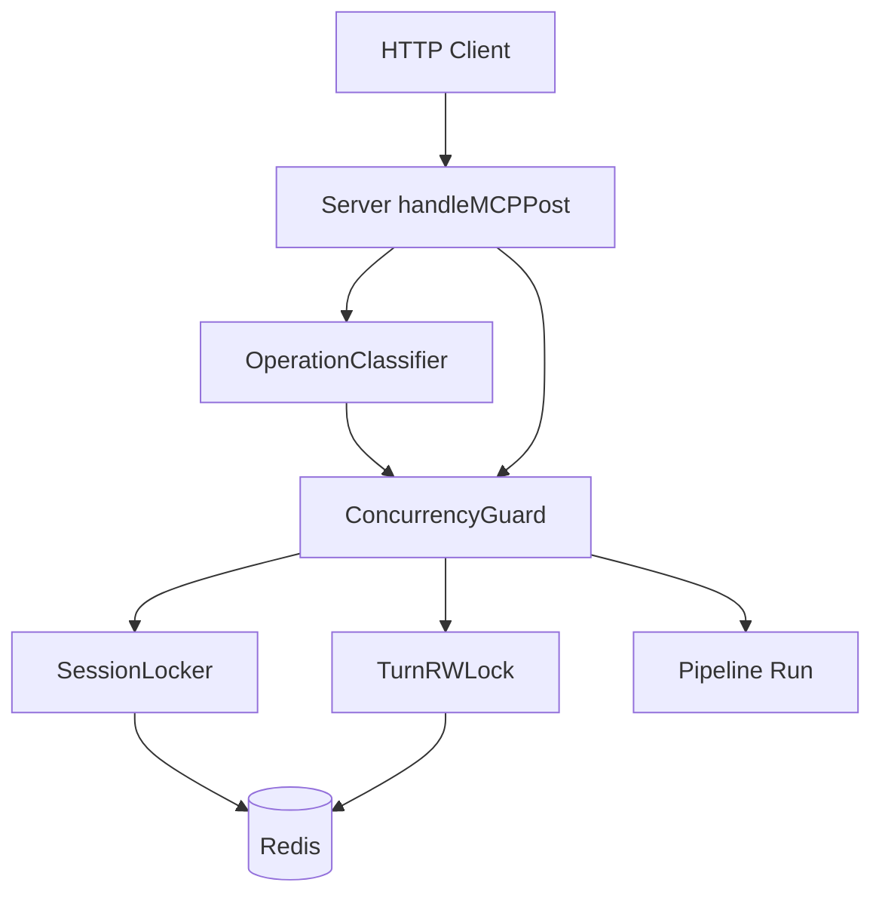
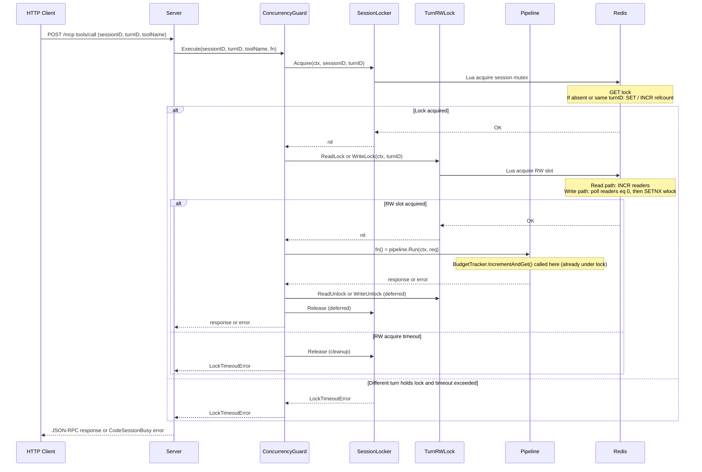

# Design: session-mgmt

## Overview

The session-mgmt feature adds a Redis-backed concurrency control layer to the MCP gateway. Without it, an agent that issues multiple tool calls in parallel within the same session can race: two calls pass the same budget check, two writes update the same customer record concurrently, and audit log entries interleave incorrectly. This design enforces two scheduling invariants: (1) only one active turn per session at a time via a reference-counted session mutex, and (2) within a turn, read-class calls run in parallel while write-class calls are serialized and wait for all reads to finish.

The feature is implemented as a **server-level middleware wrapper** (`ConcurrencyGuard`) rather than a pipeline `Handler`. This preserves the existing pipeline halt semantics — a `Handler` that returns `(nil, nil)` has no way to execute code after the downstream chain completes, making it impossible to release a lock it acquired. Wrapping `pipeline.Run()` directly at the `handleMCPPost` call site gives clean `defer`-based release without any changes to the `Handler` or `Pipeline` interfaces.

This design depends on `policy-gate` (the pipeline, types, and policy YAML structures it provides) and introduces Redis as a new runtime dependency. The BudgetTracker from `policy-gate` does not need changes: because it is called inside `PolicyGateHandler.Handle()`, which is called inside `pipeline.Run()`, which is called inside `ConcurrencyGuard.Execute()` after locks are held, budget increments are already accurate under this design.

### Goals
- Serialize same-session turns (one active turn per session at a time)
- Allow parallel reads within a turn; serialize writes; block writes until current reads drain
- Make the per-turn budget counter accurate under concurrent load automatically
- Expose `SessionLocker.Extend()` as a hook for approval-flow's approval-wait hold

### Non-Goals
- Durable turn history in Postgres (turns are ephemeral Redis state only; v1+)
- Per-session budget rollups across turns (v1+)
- Multi-node Redlock / Redis Sentinel (single Redis instance, v0 demo only)
- TTL heartbeat during approval hold (approval-flow will call `Extend()` directly; not owned here)
- Queue-based worker pool scheduling (v1 Kubernetes design)
- Writer-preference in the RWLock (reader-preference is sufficient for v0; upgradeable in v1)

## Boundary Commitments

### This Spec Owns
- **Session mutex**: reference-counted Redis key pair `session:<sessionID>:lock` / `session:<sessionID>:refcount`, acquired per turn, released when all in-flight calls for the turn complete
- **Per-turn RWLock**: Redis key pair `turn:<turnID>:readers` / `turn:<turnID>:wlock`, managed via Lua scripts
- **OperationClassifier**: maps tool names to `OperationClass` using a configurable map with default-prefix heuristic fallback
- **ConcurrencyGuard**: server-level wrapper that combines SessionLocker + TurnRWLock with correct acquire/release ordering and `defer`-based cleanup
- **Redis client setup** and Docker Compose wiring for the Redis service
- **`CodeSessionBusy` (-32002)** JSON-RPC error code constant
- **`SessionLockTTL`** and **`LockAcquireTimeout`** configuration fields with documented defaults
- **`AgentPolicy.OperationClasses`** field extension (configurable map in policy YAML)

### Out of Boundary
- Slack integration, pub/sub, or approval notification (approval-flow, slice 4)
- Durable turn history in Postgres
- Approval-hold TTL extension — approval-flow calls `SessionLocker.Extend()` directly; this spec only exposes the method
- Multi-node Redis / Redlock
- Changes to the `Handler` or `Pipeline` interfaces (bare-proxy)
- Changes to `BudgetTracker` internals (policy-gate)

### Allowed Dependencies
- `cmd/gateway`: existing config, server, pipeline, policy types — may extend but not restructure
- `core/mcp`: may add new error codes; must not change `Handler`, `Pipeline`, or existing type contracts
- `github.com/redis/go-redis/v9` v9.19.0 — new runtime dependency
- Postgres (existing, no new schema changes)

### Revalidation Triggers
- Changes to `ConcurrencyGuard.Execute()` signature or lock ordering → `server.go` integration breaks
- Changes to `SessionLocker.Extend()` method signature → approval-flow integration breaks
- Changes to `AgentPolicy.OperationClasses` field name or type → policy YAML loading and OperationClassifier break
- New pipeline handlers inserted before `pipeline.Run()` in `handleMCPPost` → may bypass the guard; review needed
- Redis key name schema changes → break any monitoring or manual inspection tooling

## Architecture

### Existing Architecture Analysis

Post policy-gate, the gateway request path is:

```
HTTP POST /mcp → handleMCPPost()
  → validate session (SessionRegistry)
  → extract turnID from X-Mcp-Turn-Id header (or generate UUID)
  → set sessionID + turnID in context
  → pipeline.Run(ctx, req):
      1. RequestLogger.Handle()     → nil, nil (continue)
      2. ContextInjector.Handle()   → nil, nil (continue)
      3. PolicyGateHandler.Handle() → BudgetTracker.IncrementAndGet() → policy eval → halt or continue
      4. UpstreamForwarder          → halt with upstream response
```

`ConcurrencyGuard.Execute()` wraps step 3–4 (the `pipeline.Run()` call) and runs after session validation but before the pipeline:

```
HTTP POST /mcp → handleMCPPost()
  → validate session
  → extract operation name from request params
  → guard.Execute(sessionID, turnID, operation, fn):
      → SessionLocker.Acquire()       ← new
      → TurnRWLock.ReadLock / WriteLock ← new
      → fn() = pipeline.Run(ctx, req) ← existing
      → TurnRWLock.ReadUnlock / WriteUnlock (deferred) ← new
      → SessionLocker.Release (deferred) ← new
```

### Architecture Pattern & Boundary Map



**Architecture decisions**:
- **Server-level wrapper** (not a pipeline Handler): preserves halt contract; enables `defer`-based lock release after pipeline returns
- **Build custom Lua wrappers** (not redsync / redis-rwlock): single Redis node in v0; ~80 total lines of Lua across all scripts; avoids obscure third-party lock library
- **Reference-counted session mutex**: multiple concurrent calls within the same turn (same turnID) re-enter the mutex; lock is only released when all calls for that turn complete

### Technology Stack

| Layer | Choice / Version | Role | Notes |
|-------|-----------------|------|-------|
| Backend | Go 1.25 | Existing | No change |
| Redis client | `github.com/redis/go-redis/v9` v9.19.0 | Session mutex + RWLock operations via `Eval()` | New dependency; Go 1.24+ compatible |
| Redis | Redis 7-alpine (Docker) | Ephemeral lock store | New service in `docker-compose.yml` |
| Lua scripts | Inline Go strings, executed via `Eval()` | Atomic lock acquire / release / extend | All state transitions are single-script atomic |

## File Structure Plan

### New Files

```
cmd/gateway/
├── redis.go                    # NewRedisClient(cfg Config) (*redis.Client, error) — connection setup + Ping validation
├── session_locker.go           # SessionLocker — reference-counted session mutex via Lua scripts
├── turn_rwlock.go              # TurnRWLock — per-turn reader-writer lock via Lua scripts
├── concurrency_guard.go        # ConcurrencyGuard — combines SessionLocker + TurnRWLock; wraps pipeline execution
├── classifier.go               # OperationClassifier — classifies tool names as read or write class
├── session_locker_test.go      # Unit tests: acquire/re-enter/release/extend/timeout for SessionLocker
├── turn_rwlock_test.go         # Unit tests: parallel reads, write-blocks-read, write serialization
└── concurrency_guard_test.go   # Integration tests: concurrent goroutines, timeout, cross-session isolation
```

### Modified Files

- `cmd/gateway/config.go` — Add `RedisDSN string` (env `REDIS_DSN`), `SessionLockTTL time.Duration` (env `SESSION_LOCK_TTL`, default `60s`), `LockAcquireTimeout time.Duration` (env `LOCK_ACQUIRE_TIMEOUT`, default `5s`)
- `cmd/gateway/server.go` — Add `guard *ConcurrencyGuard` field to `Server`; in `handleMCPPost`, extract operation name from request params, then call `guard.Execute()` wrapping the existing `pipeline.Run()` call
- `cmd/gateway/main.go` — Instantiate `RedisClient`, `SessionLocker`, `TurnRWLock`, `OperationClassifier`, `ConcurrencyGuard`; pass guard into `Server`; terminate Redis connection on shutdown
- `cmd/gateway/policy_gate.go` — Add `OperationClasses map[string]string` field to `AgentPolicy` struct; update YAML loader to parse it (values `"read"` / `"write"`)
- `core/mcp/types.go` — Add `CodeSessionBusy = -32002` constant
- `docker-compose.yml` — Add `redis:7-alpine` service with healthcheck; add `REDIS_DSN=redis://redis:6379/0` env var to gateway service; add `redis` to gateway `depends_on`

## System Flows

### Turn Acquisition and Release



**Key flow decisions**:
- Acquire order is always: session mutex → turn RWLock. Release order (deferred) is: turn RWLock → session mutex. Inverting either direction risks deadlock.
- The guard bypasses locking entirely for non-`tools/call` methods (e.g., `initialize`, `ping`).
- `BudgetTracker.IncrementAndGet()` is called inside `pipeline.Run()`, which is called inside `fn()`, which is called after both locks are held — budget accuracy (Req 5.1) is satisfied without any BudgetTracker changes.

## Requirements Traceability

| Requirement | Summary | Component | Key Interface / Contract |
|-------------|---------|-----------|--------------------------|
| 1.1 | Different sessions never block each other | ConcurrencyGuard, SessionLocker | Locks namespaced by sessionID; no shared cross-session state |
| 2.1 | Hold new turn while active | SessionLocker.Acquire() + busy-wait poll | `Acquire(ctx, sessionID, turnID) error` |
| 2.2 | JSON-RPC error on timeout | LockTimeoutError → CodeSessionBusy | `LockTimeoutError.JSONRPCCode() = -32002` |
| 2.3 | Release on turn completion | ConcurrencyGuard deferred release | `defer SL.Release()` in `Execute()` |
| 2.4 | Restart drops locks | Redis ephemeral | Documented; no Postgres fallback |
| 2.5 | Configurable session-lock TTL | Config.SessionLockTTL | env `SESSION_LOCK_TTL` (default `60s`) |
| 2.6 | Configurable lock-acquisition timeout | Config.LockAcquireTimeout | env `LOCK_ACQUIRE_TIMEOUT` (default `5s`) |
| 3.1 | Parallel reads within turn | TurnRWLock.ReadLock() | Lua: INCR readers if no wlock present |
| 3.2 | Write waits for reads to drain | TurnRWLock.WriteLock() | Lua: poll until readers == 0, then SET NX wlock |
| 3.3 | Writes serialized | TurnRWLock.WriteLock() | SET NX wlock blocks concurrent writers |
| 3.4 | Call removed from per-turn registry | ReadUnlock / WriteUnlock | Lua: DECR readers / compare-and-delete wlock |
| 4.1 | Configurable operation classification | OperationClassifier, AgentPolicy.OperationClasses | map[string]string in policy.yaml |
| 4.2 | Default heuristic | OperationClassifier.Classify() | `read_`, `get_`, `list_` prefix → read; else write |
| 5.1 | Budget counter accurate under concurrency | ConcurrencyGuard wraps pipeline.Run() | BudgetTracker called inside fn(), after locks acquired |

## Components and Interfaces

### Summary

| Component | Layer | Intent | Req Coverage | Key Dependencies | Contracts |
|-----------|-------|--------|--------------|-----------------|-----------|
| SessionLocker | cmd/gateway | Reference-counted session mutex | 1.1, 2.1–2.6 | go-redis/v9 | Service |
| TurnRWLock | cmd/gateway | Per-turn reader-writer lock | 3.1–3.4 | go-redis/v9 | Service |
| ConcurrencyGuard | cmd/gateway | Server middleware wrapping pipeline.Run() | 1.1, 2.3, 5.1 | SessionLocker, TurnRWLock, OperationClassifier | Service |
| OperationClassifier | cmd/gateway | Maps tool names to OperationClass | 4.1, 4.2 | AgentPolicy.OperationClasses | Service |
| Redis factory (`redis.go`) | cmd/gateway | Constructs validated Redis client from config | — | go-redis/v9, Config | — |

---

### SessionLocker

| Field | Detail |
|-------|--------|
| Intent | Reference-counted session mutex that serializes turns per session; safe for re-entry within the same turn |
| Requirements | 1.1, 2.1, 2.2, 2.3, 2.4, 2.5, 2.6 |

**Responsibilities & Constraints**
- Owns Redis keys `session:<sessionID>:lock` (string → turnID) and `session:<sessionID>:refcount` (int)
- Acquire Lua: if key absent → SET lock + SET refcount=1 + EX TTL; if key matches turnID → INCR refcount + EXPIRE; else → return 0 (blocked)
- Release Lua: if key matches turnID → DECR refcount; if refcount ≤ 0 → DEL both keys; else → return remaining count
- Extend Lua: if key matches turnID → EXPIRE both keys by TTL; else → return 0 (expired or stolen)
- When blocked, busy-waits with 50ms poll interval until `LockAcquireTimeout` elapses, then returns `LockTimeoutError`

**Dependencies**
- External: `github.com/redis/go-redis/v9` — `Eval()` for atomic Lua operations (P0)

**Contracts**: Service [x]

##### Service Interface
```go
type OperationClass int

const (
    OperationClassRead  OperationClass = iota
    OperationClassWrite
)

type LockTimeoutError struct{ Message string }
func (e *LockTimeoutError) Error() string       { return e.Message }
func (e *LockTimeoutError) JSONRPCCode() int    { return CodeSessionBusy }

type SessionLocker struct { /* unexported: rdb, lockTTL, acquireTimeout */ }

func NewSessionLocker(rdb *redis.Client, lockTTL, acquireTimeout time.Duration) *SessionLocker

// Acquire acquires or re-enters the session mutex for the given turnID.
// Blocks by polling until acquired or acquireTimeout elapses.
// Returns LockTimeoutError if a different turn holds the lock and the timeout elapses.
func (l *SessionLocker) Acquire(ctx context.Context, sessionID, turnID string) error

// Release decrements the reference count; deletes both keys when count reaches zero.
func (l *SessionLocker) Release(ctx context.Context, sessionID, turnID string) error

// Extend refreshes the TTL on both session lock keys. Intended for approval-flow use
// during approval-wait holds. Returns an error if the lock is not held by turnID.
func (l *SessionLocker) Extend(ctx context.Context, sessionID, turnID string) error
```

**Implementation Notes**
- All three operations use single Lua scripts via `rdb.Eval()` — no TOCTOU races
- `Extend()` is exposed but not called by session-mgmt itself; approval-flow will call it during the approval hold
- On Redis connectivity error, return an error wrapping `CodeInternalError`; do not block indefinitely

---

### TurnRWLock

| Field | Detail |
|-------|--------|
| Intent | Per-turn reader-writer lock; allows concurrent reads, serializes writes, and blocks new writes until all current reads complete |
| Requirements | 3.1, 3.2, 3.3, 3.4 |

**Responsibilities & Constraints**
- Owns Redis keys `turn:<turnID>:readers` (int counter) and `turn:<turnID>:wlock` (string → ownerToken UUID4)
- ReadLock Lua: if wlock absent → INCR readers + EXPIRE; else → return 0 (blocked)
- ReadUnlock Lua: DECR readers (no owner check needed; readers are fungible)
- WriteLock Lua: if readers == 0 and wlock absent → SET wlock NX ownerToken EX TTL; else → return 0 (blocked)
- WriteUnlock Lua: if wlock == ownerToken → DEL wlock; else → no-op (already expired or wrong owner)
- v0 uses reader-preference (new reads may arrive before a waiting writer); upgradeable to writer-preference in v1

**Dependencies**
- External: `github.com/redis/go-redis/v9` — `Eval()` (P0)

**Contracts**: Service [x]

##### Service Interface
```go
type TurnRWLock struct { /* unexported: rdb, lockTTL, acquireTimeout */ }

func NewTurnRWLock(rdb *redis.Client, lockTTL, acquireTimeout time.Duration) *TurnRWLock

// ReadLock acquires a read slot. Multiple callers may hold simultaneously.
// Blocks if a writer holds the write lock. Returns LockTimeoutError on timeout.
func (rw *TurnRWLock) ReadLock(ctx context.Context, turnID string) error

// ReadUnlock releases a read slot.
func (rw *TurnRWLock) ReadUnlock(ctx context.Context, turnID string) error

// WriteLock acquires exclusive write access. Waits for all readers to complete and
// for any prior writer to release. Returns the ownerToken and LockTimeoutError on timeout.
func (rw *TurnRWLock) WriteLock(ctx context.Context, turnID string) (ownerToken string, err error)

// WriteUnlock releases the write lock. No-op if ownerToken does not match (already expired).
func (rw *TurnRWLock) WriteUnlock(ctx context.Context, turnID, ownerToken string) error
```

**Implementation Notes**
- `ownerToken` is a `crypto/rand` UUID4 generated at WriteLock time; prevents a timed-out writer from unlocking a successor's write lock
- Keys share the same TTL as the session mutex; auto-expire if the gateway crashes mid-turn
- ReadUnlock has no owner token because readers are anonymous and fungible

---

### OperationClassifier

| Field | Detail |
|-------|--------|
| Intent | Pure function: maps an MCP tool name to OperationClass using a configurable map with default-prefix heuristic |
| Requirements | 4.1, 4.2 |

**Responsibilities & Constraints**
- Input: the tool name extracted from `tools/call` request params (not the JSON-RPC method string)
- Configurable map (`AgentPolicy.OperationClasses`) takes precedence over the heuristic
- Default heuristic: prefix `read_`, `get_`, or `list_` → `OperationClassRead`; all others → `OperationClassWrite`
- No Redis interaction; independently testable without infrastructure

**Dependencies**
- Inbound: `AgentPolicy.OperationClasses map[string]string` (P1)

**Contracts**: Service [x]

##### Service Interface
```go
type OperationClassifier struct { /* unexported: classes map[string]OperationClass */ }

func NewOperationClassifier(classes map[string]string) *OperationClassifier

// Classify returns OperationClassRead or OperationClassWrite for the given tool name.
// Explicit entries in the configurable map take precedence over the default heuristic.
func (c *OperationClassifier) Classify(toolName string) OperationClass
```

---

### ConcurrencyGuard

| Field | Detail |
|-------|--------|
| Intent | Server-level middleware combining SessionLocker + TurnRWLock; wraps pipeline.Run() with correct acquire/release ordering and deferred cleanup |
| Requirements | 1.1, 2.3, 5.1 |

**Responsibilities & Constraints**
- Bypasses locking for non-`tools/call` JSON-RPC methods (operation == "" or method != "tools/call")
- Acquire order: SessionLocker first, then TurnRWLock — must not be inverted
- Release order (via `defer`): TurnRWLock first, then SessionLocker — symmetric to acquire
- On `LockTimeoutError` from either locker, returns the error without calling `fn()`; releases any partially-held locks
- Propagates `fn()` return values unchanged

**Dependencies**
- Inbound: `SessionLocker`, `TurnRWLock`, `OperationClassifier` (all P0)
- Outbound: `fn func() (*mcp.JSONRPCResponse, error)` = `pipeline.Run(ctx, req)` (P0)

**Contracts**: Service [x]

##### Service Interface
```go
type ConcurrencyGuard struct { /* unexported: locker, rwlock, classifier */ }

func NewConcurrencyGuard(
    locker     *SessionLocker,
    rwlock     *TurnRWLock,
    classifier *OperationClassifier,
) *ConcurrencyGuard

// Execute runs fn under the session mutex and turn RWLock for the given
// sessionID, turnID, and toolName. For non-tools/call requests (toolName == ""),
// calls fn directly without any locking. Returns LockTimeoutError if lock
// acquisition times out before fn is called.
func (g *ConcurrencyGuard) Execute(
    ctx       context.Context,
    sessionID string,
    turnID    string,
    toolName  string,
    fn        func() (*mcp.JSONRPCResponse, error),
) (*mcp.JSONRPCResponse, error)
```

**Implementation Notes**
- `toolName` is extracted from `req.Params` in `handleMCPPost` before calling Execute; the guard does not parse request params itself
- Budget accuracy (5.1) is automatic: `BudgetTracker.IncrementAndGet()` runs inside `fn()`, after both locks are held
- Use `recover()` inside Execute to prevent a panicking pipeline from leaking locks

## Data Models

### Redis Key Schema

| Key Pattern | Type | Value | TTL |
|-------------|------|-------|-----|
| `session:<sessionID>:lock` | string | turnID of current lock holder | `SessionLockTTL` (refreshed on re-enter and Extend) |
| `session:<sessionID>:refcount` | int | count of in-flight calls for the holding turn | `SessionLockTTL` |
| `turn:<turnID>:readers` | int | count of active read-class calls | `SessionLockTTL` |
| `turn:<turnID>:wlock` | string | ownerToken UUID4 of current writer | `SessionLockTTL` (SET NX EX) |

Keys are created on first lock acquisition and deleted on final release (refcount / readers reaching 0). They auto-expire via TTL if the gateway crashes or hangs.

**Restart behavior**: A gateway restart clears all in-memory state and drops the Redis connection; Redis keys with TTL auto-expire. New requests may acquire locks immediately after restart — this is the documented v0 behavior (see Non-Goals).

### AgentPolicy Extension

```go
// In cmd/gateway/policy_gate.go (or equivalent policy types file)
type AgentPolicy struct {
    // ... existing fields (Rules, Budgets, etc.) ...
    OperationClasses map[string]string `yaml:"operationClasses"`
    // values: "read" | "write"; absence falls back to OperationClassifier heuristic
}
```

**YAML example**:
```yaml
operationClasses:
  stripe_get_payment: read
  stripe_list_refunds: read
  stripe_create_refund: write
  zendesk_update_ticket: write
```

### Config Extension

```go
type Config struct {
    // ... existing fields ...
    RedisDSN           string        // REDIS_DSN (required when session-mgmt enabled)
    SessionLockTTL     time.Duration // SESSION_LOCK_TTL (default: 60s)
    LockAcquireTimeout time.Duration // LOCK_ACQUIRE_TIMEOUT (default: 5s)
}
```

## Error Handling

### Error Strategy

Lock acquisition failures surface as `LockTimeoutError`, which implements `JSONRPCCode() int` returning `CodeSessionBusy (-32002)`. This integrates with the existing `jsonRPCCode()` extraction in `server.go` with no changes to the error-propagation path — same pattern as `policyGateParamsError` and `upstreamError`.

### Error Categories

| Error | Code | Cause | Client Guidance |
|-------|------|-------|----------------|
| `LockTimeoutError` | -32002 (CodeSessionBusy) | Session mutex or turn RWLock not acquired within `LockAcquireTimeout` | Retry after a delay; another turn is still active |
| Redis connectivity | -32603 (CodeInternalError) | `rdb.Eval()` returns a network error | Gateway health issue; do not retry immediately |
| Lua script error | -32603 (CodeInternalError) | Unexpected Redis response from script | Bug; logged with key context |

### Monitoring

Structured `slog` entries:
- **Warn**: each lock acquire that requires more than one poll iteration — fields: `sessionID`, `turnID`, `operation_class`, `lock_wait_ms`
- **Error**: `LockTimeoutError` and Redis connectivity failures — fields as above plus `error`
- **Debug**: successful lock acquire/release cycle — for local development tracing

## Testing Strategy

### Unit Tests (`cmd/gateway/`)

**OperationClassifier** (`classifier_test.go`):
- Explicit `"read"` map entry → `OperationClassRead`
- Explicit `"write"` map entry → `OperationClassWrite`
- No entry, `get_` prefix → `OperationClassRead` (heuristic)
- No entry, no prefix → `OperationClassWrite` (heuristic default)

**SessionLocker** (`session_locker_test.go`, requires real Redis or `miniredis`):
- Acquire with no prior lock → success, refcount=1
- Re-enter with same turnID → success, refcount=2
- Two sequential Releases → refcount=1, then 0 with keys deleted
- Acquire with different turnID while locked → polls, then LockTimeoutError after timeout
- Extend while holding lock → refreshes TTL; Extend after release → returns error

**TurnRWLock** (`turn_rwlock_test.go`):
- Two concurrent `ReadLock` calls → both succeed simultaneously (readers=2)
- `WriteLock` while readers > 0 → blocks until `ReadUnlock` called; then succeeds
- Two concurrent `WriteLock` calls → only one succeeds; second serialized after first `WriteUnlock`
- `WriteUnlock` with wrong token → no-op; subsequent `WriteUnlock` with correct token succeeds

### Integration Tests (`concurrency_guard_test.go`)

- **Same-session, same-turn parallel reads**: Two goroutines call `Execute(sessionID, turnID, "get_X", fn)` concurrently; verify both `fn()` calls run simultaneously (both in-flight before either returns)
- **Same-session, different-turn serialization**: Turn A holds lock; Turn B calls `Execute(sessionID, turnBID, ...)` → waits → receives `LockTimeoutError` before Turn A completes
- **Cross-session isolation**: Two goroutines with different `sessionID` values; both proceed without blocking; verify no shared Redis state
- **Budget counter accuracy**: Two concurrent `tools/call` requests in same session/turn; verify budget counter reaches 2 (not 1 due to race)

### E2E Tests

- **Docker Compose**: Gateway + Redis; demo agent issues a `tools/call`; verify `session:*:lock` key exists in Redis during processing and is deleted after response
- **Restart safety**: Gateway restarted mid-turn (SIGKILL); verify next request for a freshly initialized session acquires its lock immediately (no stuck Redis key remains from the pre-restart session). The old `Mcp-Session-Id` is intentionally invalid post-restart per Req 2.4 — this test proves Redis lock cleanup, not session durability.

## Performance & Scalability

- **Uncontended latency overhead**: < 1ms per request (single Redis round trip per Lua script, local Docker network)
- **Poll interval**: 50ms busy-wait between attempts; max 100 polls at default 5s timeout
- **Redis connection pool**: go-redis defaults (10 connections); sufficient for single-node v0 demo
- **Scalability note**: This design targets a single-process demo. Multi-process or multi-node use requires Redlock (redsync) for the session mutex and writer-preference RWLock; both are v1 upgrades.
